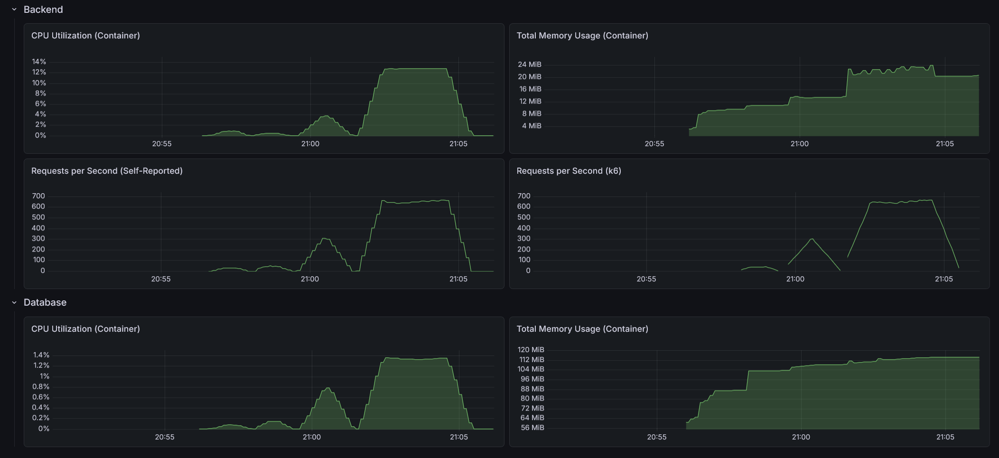

# RealWorld Backend: Go + Chi (Hexagonal Architecture)

This is an implementation of the [RealWorld API](https://docs.realworld.show/specs/backend-specs/introduction/) using Go, the `chi` router, and **Hexagonal Architecture** (also known as Ports and Adapters).

## Architecture

This implementation strictly separates business logic from technical concerns using the Hexagonal pattern:

- **Domain Layer**: The core of the application. Contains pure Go structs (Entities) and business logic. It has zero dependencies on external frameworks or other layers.
- **Application Layer**: Orchestrates domain objects to fulfill use cases.
    - **Ports**: Interfaces defining the input (Service Ports) and output (Repository Ports) requirements.
    - **Application Services**: Implementations of service ports that coordinate business logic and interact with output ports.
- **Infrastructure Layer**: Technical details and library-specific code.
    - **Adapters (In/Out)**: Connect the application to the outside world.
        - **Web (In)**: Chi handlers that parse HTTP requests and format JSON responses.
        - **Persistence (Out)**: Repository implementations using `sqlx` and SQL queries.
    - **Configuration**: Application initialization, dependency injection, and database setup.
    - **Security**: JWT authentication and password hashing (Bcrypt).

## Tech Stack

- **Go 1.26**
- **Chi**: Lightweight and idiomatic router
- **Sqlx**: General purpose extensions to `database/sql`
- **SQLite / PostgreSQL**: Supported via configuration
- **Validator**: Request validation using `go-playground/validator`
- **Httplog**: Structured logging for HTTP requests
- **OpenTelemetry**: Distributed tracing and monitoring
- **Testify**: Toolkit for unit and integration testing

## Directory Structure

```text
.
├── cmd/
│   └── realworld/          # Main entry point - Wires dependencies
├── internal/
│   ├── domain/             # Core business models and entities
│   ├── application/        # Use cases and port definitions
│   │   ├── port/           # Service and Repository interfaces
│   │   └── service/        # Business logic implementation
│   └── infrastructure/     # Technical details (Adapters)
│       ├── web/            # HTTP Handlers and DTOs
│       ├── persistence/    # SQL Repository implementations
│       ├── configuration/  # App setup and DB initialization
│       └── security/       # JWT and Auth implementations
├── tests/
│   ├── integration/        # End-to-end API tests
│   └── testmocks/          # Manually maintained mocks for testing
├── go.mod                  # Go module definition
└── README.md
```

## Why this works for Go

Go's **implicit interfaces** are a perfect fit for Hexagonal Architecture. The `application` layer defines the `Repository` interface it requires, and the `infrastructure/persistence` layer satisfies it without ever needing to import the application package. This ensures a clean, one-way dependency flow towards the domain core.

## SQLite Performance & Testing Caveats

For local development and unit/integration tests, this project supports an in-memory SQLite database. To ensure data consistency across the connection pool in SQLite's in-memory mode, `MaxOpenConns` is restricted to `1`.

**Note on Performance:**
- This single-connection restriction impacts performance and concurrency.
- **Load Testing:** Do NOT use the local SQLite setup for load tests or performance comparisons.
- **Environment Parity:** For meaningful performance benchmarks or production-like testing, use the provided Docker setup with a **PostgreSQL** database. This ensures a realistic multi-connection environment comparable to other implementations.

## Performance

- Max CPU Utilization: 12.9%
- Max Memory Usage: 24.1 MiB
- Max Requests per Second: 667 / 669



### API test suite

- On startup: 0.8s
- After 10 warm-up runs: 0.8s
- After load test: 0.8s

### Load test suite

#### Light load (10 VUs / 30s)

    HTTP
    http_req_duration..............: avg=4.11ms   min=395.12µs med=2.38ms   max=86.57ms p(90)=4.58ms  p(95)=6.36ms 
      { expected_response:true }...: avg=4.11ms   min=395.12µs med=2.38ms   max=86.57ms p(90)=4.58ms  p(95)=6.36ms 
      { name:AddComment }..........: avg=3.49ms   min=2.01ms   med=2.97ms   max=19.44ms p(90)=4.41ms  p(95)=5.34ms 
      { name:CreateArticle }.......: avg=5.49ms   min=3.15ms   med=4.44ms   max=53.64ms p(90)=5.4ms   p(95)=6.44ms 
      { name:DeleteArticle }.......: avg=3.74ms   min=2.39ms   med=3.32ms   max=20.42ms p(90)=4.52ms  p(95)=6.08ms 
      { name:DeleteComment }.......: avg=2.58ms   min=1.7ms    med=2.31ms   max=9.8ms   p(90)=3.31ms  p(95)=4ms    
      { name:FavoriteArticle }.....: avg=3.35ms   min=1.84ms   med=2.7ms    max=23.08ms p(90)=4.43ms  p(95)=6.09ms 
      { name:FollowUser }..........: avg=2.48ms   min=1.6ms    med=2.28ms   max=10.72ms p(90)=3.01ms  p(95)=3.62ms 
      { name:GetArticle }..........: avg=1.05ms   min=547.13µs med=942.95µs max=5.51ms  p(90)=1.31ms  p(95)=1.68ms 
      { name:GetArticlesFeed }.....: avg=1.38ms   min=591.73µs med=1.08ms   max=6.33ms  p(90)=2.13ms  p(95)=3.11ms 
      { name:GetComments }.........: avg=1.53ms   min=738.94µs med=1.27ms   max=12.34ms p(90)=2.16ms  p(95)=2.97ms 
      { name:GetCurrentUser }......: avg=811.01µs min=567.53µs med=818.74µs max=1.25ms  p(90)=1.04ms  p(95)=1.06ms 
      { name:GetGlobalArticles }...: avg=3.27ms   min=2.12ms   med=3.01ms   max=9.67ms  p(90)=4.11ms  p(95)=4.97ms 
      { name:GetProfile }..........: avg=882.34µs min=398.92µs med=786.64µs max=4.67ms  p(90)=1.18ms  p(95)=1.38ms 
      { name:GetTags }.............: avg=731.35µs min=395.12µs med=618.58µs max=4.44ms  p(90)=1.01ms  p(95)=1.14ms 
      { name:Login }...............: avg=57.31ms  min=52.73ms  med=55.01ms  max=79.14ms p(90)=63.41ms p(95)=67.45ms
      { name:Register }............: avg=59.08ms  min=54.43ms  med=57.69ms  max=86.57ms p(90)=62.87ms p(95)=65.02ms
      { name:UnfavoriteArticle }...: avg=2.88ms   min=1.94ms   med=2.54ms   max=13.34ms p(90)=3.89ms  p(95)=4.67ms 
      { name:UnfollowUser }........: avg=2.41ms   min=1.33ms   med=1.96ms   max=27.76ms p(90)=2.83ms  p(95)=3.23ms 
    http_req_failed................: 0.00%  0 out of 2447
    http_reqs......................: 2447   78.09877/s

    EXECUTION
    iteration_duration.............: avg=1.03s    min=1s       med=1.03s    max=1.12s   p(90)=1.05s   p(95)=1.06s  
    iterations.....................: 294    9.383342/s
    vus............................: 5      min=5         max=10
    vus_max........................: 10     min=10        max=10

    NETWORK
    data_received..................: 1.3 MB 43 kB/s
    data_sent......................: 642 kB 21 kB/s

#### Medium load (50 VUs / 1m)

    HTTP
    http_req_duration..............: avg=6.34ms  min=308.51µs med=2.59ms   max=344.04ms p(90)=7.87ms  p(95)=34.37ms
      { expected_response:true }...: avg=6.34ms  min=308.51µs med=2.59ms   max=344.04ms p(90)=7.87ms  p(95)=34.37ms
      { name:AddComment }..........: avg=5.27ms  min=1.94ms   med=3.11ms   max=120.86ms p(90)=7.54ms  p(95)=17ms   
      { name:CreateArticle }.......: avg=10.22ms min=2.36ms   med=4.33ms   max=264.51ms p(90)=9.62ms  p(95)=36.62ms
      { name:DeleteArticle }.......: avg=4.89ms  min=1.72ms   med=3.6ms    max=41.97ms  p(90)=7.87ms  p(95)=12.26ms
      { name:DeleteComment }.......: avg=3.47ms  min=1.5ms    med=2.44ms   max=78.65ms  p(90)=5.79ms  p(95)=8.22ms 
      { name:FavoriteArticle }.....: avg=4.68ms  min=1.76ms   med=2.95ms   max=71.31ms  p(90)=7.36ms  p(95)=13.42ms
      { name:FollowUser }..........: avg=4ms     min=804.54µs med=2.15ms   max=232.94ms p(90)=3.99ms  p(95)=5.7ms  
      { name:GetArticle }..........: avg=2.24ms  min=421.22µs med=1.01ms   max=147.83ms p(90)=2.73ms  p(95)=5.63ms 
      { name:GetArticlesFeed }.....: avg=1.45ms  min=521.33µs med=1.04ms   max=12.11ms  p(90)=2.43ms  p(95)=3.69ms 
      { name:GetComments }.........: avg=2.23ms  min=706.94µs med=1.34ms   max=51.42ms  p(90)=3.51ms  p(95)=7.01ms 
      { name:GetCurrentUser }......: avg=1.85ms  min=387.22µs med=728.84µs max=119.28ms p(90)=1.34ms  p(95)=2.72ms 
      { name:GetGlobalArticles }...: avg=4.61ms  min=1.66ms   med=3.29ms   max=45.59ms  p(90)=7.06ms  p(95)=11.97ms
      { name:GetProfile }..........: avg=1.7ms   min=381.22µs med=803.84µs max=154.15ms p(90)=1.51ms  p(95)=2.22ms 
      { name:GetTags }.............: avg=1.03ms  min=308.51µs med=714.64µs max=9.98ms   p(90)=1.9ms   p(95)=2.79ms 
      { name:Login }...............: avg=60.98ms min=52.38ms  med=55.53ms  max=225.01ms p(90)=63.72ms p(95)=72.59ms
      { name:Register }............: avg=65.48ms min=54.4ms   med=57.54ms  max=344.04ms p(90)=68.36ms p(95)=93.19ms
      { name:UnfavoriteArticle }...: avg=4.23ms  min=1.65ms   med=2.87ms   max=46.27ms  p(90)=7.22ms  p(95)=12.68ms
      { name:UnfollowUser }........: avg=3.02ms  min=1.18ms   med=1.94ms   max=106.22ms p(90)=3.42ms  p(95)=4.57ms 
    http_req_failed................: 0.00%  0 out of 18438
    http_reqs......................: 18438  299.248723/s

    EXECUTION
    iteration_duration.............: avg=1.04s   min=1s       med=1.02s    max=1.4s     p(90)=1.06s   p(95)=1.08s  
    iterations.....................: 2907   47.180607/s
    vus............................: 34     min=34         max=50
    vus_max........................: 50     min=50         max=50

    NETWORK
    data_received..................: 10 MB  165 kB/s
    data_sent......................: 4.8 MB 78 kB/s

#### Heavy load (200 VUs / 3m)

    HTTP
    http_req_duration..............: avg=103.15ms min=271.51µs med=78.15ms  max=1.07s    p(90)=229.7ms  p(95)=292.88ms
      { expected_response:true }...: avg=103.15ms min=271.51µs med=78.15ms  max=1.07s    p(90)=229.7ms  p(95)=292.88ms
      { name:AddComment }..........: avg=142.57ms min=1.73ms   med=120.92ms max=771.99ms p(90)=282.48ms p(95)=344.24ms
      { name:CreateArticle }.......: avg=156.97ms min=2.16ms   med=133.04ms max=1.06s    p(90)=284.67ms p(95)=351.11ms
      { name:DeleteArticle }.......: avg=115.48ms min=1.74ms   med=93.25ms  max=802.11ms p(90)=240.18ms p(95)=299.08ms
      { name:DeleteComment }.......: avg=104.68ms min=1.43ms   med=82.63ms  max=615.94ms p(90)=221.61ms p(95)=282.1ms 
      { name:FavoriteArticle }.....: avg=138.79ms min=1.6ms    med=117.11ms max=867.87ms p(90)=281.01ms p(95)=338.96ms
      { name:FollowUser }..........: avg=106.43ms min=1.32ms   med=86.02ms  max=716.22ms p(90)=221.48ms p(95)=276.78ms
      { name:GetArticle }..........: avg=56.93ms  min=452.92µs med=39.12ms  max=545.79ms p(90)=130.58ms p(95)=168.16ms
      { name:GetArticlesFeed }.....: avg=59.14ms  min=408.82µs med=38.25ms  max=545.09ms p(90)=138.38ms p(95)=181.85ms
      { name:GetComments }.........: avg=83.22ms  min=578.03µs med=61.8ms   max=872.28ms p(90)=182.28ms p(95)=232.19ms
      { name:GetCurrentUser }......: avg=38.58ms  min=376.02µs med=22.92ms  max=832.38ms p(90)=92.51ms  p(95)=128.16ms
      { name:GetGlobalArticles }...: avg=147.15ms min=1.58ms   med=123.36ms max=731.85ms p(90)=297.31ms p(95)=358.3ms 
      { name:GetProfile }..........: avg=46.5ms   min=408.12µs med=30.31ms  max=890.27ms p(90)=104.74ms p(95)=141.22ms
      { name:GetTags }.............: avg=28.43ms  min=271.51µs med=14.59ms  max=407.21ms p(90)=72.12ms  p(95)=97.96ms 
      { name:Login }...............: avg=117.68ms min=52.75ms  med=102.67ms max=1.02s    p(90)=175.09ms p(95)=206.11ms
      { name:Register }............: avg=240.37ms min=54.81ms  med=218.89ms max=1.07s    p(90)=383.32ms p(95)=447.7ms 
      { name:UnfavoriteArticle }...: avg=136.63ms min=1.32ms   med=114.12ms max=805.09ms p(90)=282.52ms p(95)=338.03ms
      { name:UnfollowUser }........: avg=90.89ms  min=1.33ms   med=73.79ms  max=716.96ms p(90)=192.99ms p(95)=233.81ms
    http_req_failed................: 0.00%  0 out of 117755
    http_reqs......................: 117755 647.71882/s

    EXECUTION
    iteration_duration.............: avg=1.5s     min=1s       med=1.29s    max=3.61s    p(90)=2.23s    p(95)=2.43s   
    iterations.....................: 23947  131.721987/s
    vus............................: 173    min=173         max=200
    vus_max........................: 200    min=200         max=200

    NETWORK
    data_received..................: 63 MB  347 kB/s
    data_sent......................: 31 MB  168 kB/s