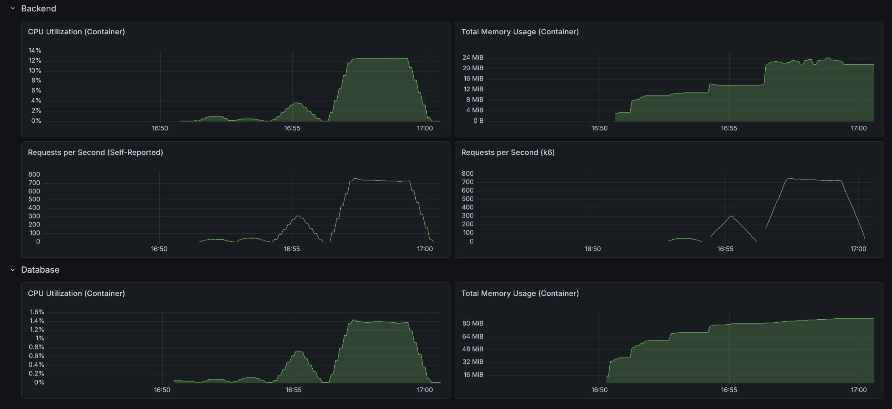

# RealWorld Backend: Go + Chi ("Hive" - Vertical Hexagonal)

This is an implementation of the [RealWorld API](https://docs.realworld.show/specs/backend-specs/introduction/) using Go, the `chi` router, and a **Vertical Hexagonal Architecture**, also known as **Hive**. It combines the isolation of Hexagonal Architecture with the locality and cohesion of Vertical Slices.

## Architecture (The Hive)

The architecture is divided into three distinct layers, organized by their role in the system:

- **Shared (`internal/shared`)**: The foundation. Contains technical primitives (logging, database setup, JWT handling, error mapping). It has zero knowledge of business logic.
- **Cells (`internal/cells`)**: The business features. Each subdirectory represents a self-contained "cell" (a mini-hexagon). A cell contains its own domain, ports (interfaces), and adapters (HTTP handlers, SQL repositories).
    - *Independence*: Cells act almost like internal microservices.
    - *Strict Communication*: Cells only communicate with each other through defined interfaces (Ports). A cell NEVER imports another cell's database adapter or handler.
- **The Hive (`internal/hive`)**: The orchestration layer (Composition Root). It depends on `shared` and all `cells`. It is responsible for instantiating the database, creating all cells, injecting dependencies (satisfying cell ports), and wiring up the final HTTP router.

*Note: In more generic naming schemes, the `cells/` directory can be named `features/`, and the `hive/` orchestration layer `app/` or `server/`.*

## Tech Stack

- **Go 1.26**
- **Chi**: Lightweight and idiomatic router
- **Sqlx**: General purpose extensions to `database/sql`
- **SQLite / PostgreSQL**: Supported via configuration
- **Validator**: Request validation using `go-playground/validator`
- **Httplog**: Structured logging for HTTP requests
- **OpenTelemetry**: Distributed tracing and monitoring
- **Testify**: Toolkit for unit and integration testing

## Directory Structure

```text
.
├── cmd/
│   └── realworld/          # Main entry point - Thin wrapper for the Hive
├── internal/
│   ├── cells/              # --- THE BUSINESS FEATURES (VERTICAL SLICES) ---
│   │   ├── user/           # User & Profile management
│   │   │   ├── domain.go   # Business entities & logic
│   │   │   ├── ports.go    # Interfaces required by this cell
│   │   │   ├── service.go  # Business orchestration
│   │   │   ├── repository.go # SQL DB Adapter
│   │   │   └── handler.go  # HTTP REST Adapter
│   │   ├── article/        # Article & Tag management
│   │   └── comment/        # Comment management
│   ├── hive/               # --- THE WIRING LAYER (COMPOSITION ROOT) ---
│   │   └── app.go          # Wires cells together, resolves dependencies
│   └── shared/             # --- TECHNICAL PRIMITIVES ---
│       ├── config/         # App configuration
│       ├── database/       # DB initialization & schema
│       ├── errors/         # Global error types
│       ├── security/       # JWT & Password hashing
│       └── web/            # Middleware & HTTP helpers
├── tests/
│   └── integration/        # End-to-end API tests
├── go.mod                  # Go module definition
└── README.md
```

## Why this works for Go

1.  **Readable Package Names**: You use `user.Service` instead of `application.UserService`.
2.  **Circular Dependency Proof**: Grouping by business boundary makes tight coupling obvious. If `article` and `user` are too entangled, the compiler prevents cyclical imports.
3.  **Scalability**: You can work on the Article feature without ever seeing the User code. It maps perfectly to team ownership in larger organizations.
4.  **Clean Entry Point**: The `main.go` file remains pristine, and the orchestration logic (`hive`) is easily testable.

## SQLite Performance & Testing Caveats

For local development and unit/integration tests, this project supports an in-memory SQLite database. To ensure data consistency across the connection pool in SQLite's in-memory mode, `MaxOpenConns` is restricted to `1`.

**Note on Performance:**
- This single-connection restriction impacts performance and concurrency.
- **Load Testing:** Do NOT use the local SQLite setup for load tests or performance comparisons.
- **Environment Parity:** For meaningful performance benchmarks or production-like testing, use the provided Docker setup with a **PostgreSQL** database. This ensures a realistic multi-connection environment comparable to other implementations.

## Performance

- Max CPU Utilization: 12.5%
- Max Memory Usage: 24.1 MiB
- Max Requests per Second: 759 / 751



### API test suite

- On startup: 0.8s
- After 10 warm-up runs: 0.8s
- After load test: 0.8s

### Load test suite

#### Light load (10 VUs / 30s)

    HTTP
    http_req_duration..............: avg=4.2ms    min=368.12µs med=2.5ms    max=85.54ms p(90)=4.89ms  p(95)=8.39ms 
      { expected_response:true }...: avg=4.2ms    min=368.12µs med=2.5ms    max=85.54ms p(90)=4.89ms  p(95)=8.39ms 
      { name:AddComment }..........: avg=3.5ms    min=2.23ms   med=2.95ms   max=12.76ms p(90)=4.86ms  p(95)=7.49ms 
      { name:CreateArticle }.......: avg=5.57ms   min=3.21ms   med=4.44ms   max=41.77ms p(90)=7.89ms  p(95)=12.51ms
      { name:DeleteArticle }.......: avg=4.03ms   min=2.47ms   med=3.44ms   max=15.17ms p(90)=5.96ms  p(95)=8.33ms 
      { name:DeleteComment }.......: avg=2.87ms   min=1.61ms   med=2.54ms   max=10.28ms p(90)=3.63ms  p(95)=5.59ms 
      { name:FavoriteArticle }.....: avg=3.45ms   min=2.06ms   med=2.87ms   max=13.84ms p(90)=4.84ms  p(95)=7.81ms 
      { name:FollowUser }..........: avg=2.89ms   min=1.24ms   med=2.27ms   max=29.85ms p(90)=5.22ms  p(95)=5.66ms 
      { name:GetArticle }..........: avg=1.14ms   min=474.92µs med=974.6µs  max=6.84ms  p(90)=1.46ms  p(95)=2.14ms 
      { name:GetArticlesFeed }.....: avg=1.3ms    min=631.03µs med=1.08ms   max=7.18ms  p(90)=1.89ms  p(95)=2.41ms 
      { name:GetComments }.........: avg=1.57ms   min=854.34µs med=1.31ms   max=6.96ms  p(90)=2.43ms  p(95)=3.73ms 
      { name:GetCurrentUser }......: avg=1.02ms   min=532.62µs med=797.24µs max=3.65ms  p(90)=1.48ms  p(95)=2.64ms 
      { name:GetGlobalArticles }...: avg=3.28ms   min=2.13ms   med=2.94ms   max=10.58ms p(90)=4.25ms  p(95)=5.14ms 
      { name:GetProfile }..........: avg=928.87µs min=400.12µs med=796.54µs max=10.13ms p(90)=1.23ms  p(95)=1.48ms 
      { name:GetTags }.............: avg=781.63µs min=368.12µs med=664.38µs max=4.76ms  p(90)=1.08ms  p(95)=1.38ms 
      { name:Login }...............: avg=55.65ms  min=52.98ms  med=54.53ms  max=66.39ms p(90)=60.6ms  p(95)=63.69ms
      { name:Register }............: avg=58.64ms  min=53.5ms   med=56.95ms  max=85.54ms p(90)=63.02ms p(95)=67.19ms
      { name:UnfavoriteArticle }...: avg=3.09ms   min=1.95ms   med=2.75ms   max=13.01ms p(90)=3.97ms  p(95)=4.56ms 
      { name:UnfollowUser }........: avg=2.21ms   min=1.35ms   med=1.99ms   max=7.49ms  p(90)=2.93ms  p(95)=3.5ms  
    http_req_failed................: 0.00%  0 out of 2423
    http_reqs......................: 2423   77.365355/s

    EXECUTION
    iteration_duration.............: avg=1.03s    min=1s       med=1.03s    max=1.08s   p(90)=1.05s   p(95)=1.06s  
    iterations.....................: 294    9.387294/s
    vus............................: 5      min=5         max=10
    vus_max........................: 10     min=10        max=10

    NETWORK
    data_received..................: 1.3 MB 43 kB/s
    data_sent......................: 635 kB 20 kB/s

#### Medium load (50 VUs / 1m)

    HTTP
    http_req_duration..............: avg=6.49ms  min=64.5µs   med=2.59ms   max=286.49ms p(90)=9.72ms  p(95)=33.63ms 
      { expected_response:true }...: avg=6.49ms  min=64.5µs   med=2.59ms   max=286.49ms p(90)=9.72ms  p(95)=33.63ms 
      { name:AddComment }..........: avg=5.29ms  min=1.57ms   med=3.02ms   max=76.75ms  p(90)=8.77ms  p(95)=16.37ms 
      { name:CreateArticle }.......: avg=10.96ms min=2.2ms    med=4.31ms   max=215.94ms p(90)=14ms    p(95)=45.31ms 
      { name:DeleteArticle }.......: avg=4.99ms  min=1.73ms   med=3.41ms   max=37.83ms  p(90)=9.25ms  p(95)=13.65ms 
      { name:DeleteComment }.......: avg=3.59ms  min=1.4ms    med=2.42ms   max=28.12ms  p(90)=6.36ms  p(95)=9.89ms  
      { name:FavoriteArticle }.....: avg=4.72ms  min=1.73ms   med=2.92ms   max=44.57ms  p(90)=8.78ms  p(95)=14.04ms 
      { name:FollowUser }..........: avg=5.14ms  min=1.3ms    med=2.23ms   max=274.79ms p(90)=4.76ms  p(95)=6.97ms  
      { name:GetArticle }..........: avg=2.17ms  min=64.5µs   med=1.01ms   max=46.91ms  p(90)=3.72ms  p(95)=7.12ms  
      { name:GetArticlesFeed }.....: avg=1.62ms  min=524.02µs med=1.04ms   max=13.76ms  p(90)=3.36ms  p(95)=5.12ms  
      { name:GetComments }.........: avg=2.36ms  min=655.33µs med=1.32ms   max=29.29ms  p(90)=4.26ms  p(95)=8.48ms  
      { name:GetCurrentUser }......: avg=1.69ms  min=332.71µs med=748.14µs max=42.42ms  p(90)=1.6ms   p(95)=3.65ms  
      { name:GetGlobalArticles }...: avg=4.97ms  min=1.66ms   med=3.23ms   max=34.87ms  p(90)=10.04ms p(95)=15.51ms 
      { name:GetProfile }..........: avg=1.68ms  min=350.61µs med=783.79µs max=172.03ms p(90)=1.68ms  p(95)=2.55ms  
      { name:GetTags }.............: avg=1.04ms  min=292.21µs med=661.23µs max=13.99ms  p(90)=2.05ms  p(95)=3.1ms   
      { name:Login }...............: avg=59.82ms min=51.08ms  med=53.88ms  max=244.74ms p(90)=63.97ms p(95)=81.87ms 
      { name:Register }............: avg=66.28ms min=52.82ms  med=56.33ms  max=286.49ms p(90)=81ms    p(95)=117.67ms
      { name:UnfavoriteArticle }...: avg=4.41ms  min=1.46ms   med=2.83ms   max=39.1ms   p(90)=8.22ms  p(95)=13.04ms 
      { name:UnfollowUser }........: avg=3.05ms  min=1.23ms   med=2.01ms   max=75.27ms  p(90)=3.91ms  p(95)=5.68ms  
    http_req_failed................: 0.00%  0 out of 18503
    http_reqs......................: 18503  300.33947/s

    EXECUTION
    iteration_duration.............: avg=1.04s   min=1s       med=1.02s    max=1.35s    p(90)=1.06s   p(95)=1.1s    
    iterations.....................: 2905   47.153768/s
    vus............................: 32     min=32         max=50
    vus_max........................: 50     min=50         max=50

    NETWORK
    data_received..................: 10 MB  166 kB/s
    data_sent......................: 4.8 MB 78 kB/s

#### Heavy load (200 VUs / 3m)

    HTTP
    http_req_duration..............: avg=76.7ms   min=41µs     med=54.56ms max=976.6ms  p(90)=172.47ms p(95)=225.36ms
      { expected_response:true }...: avg=76.7ms   min=41µs     med=54.56ms max=976.6ms  p(90)=172.47ms p(95)=225.36ms
      { name:AddComment }..........: avg=93.58ms  min=1.63ms   med=77.05ms max=640.2ms  p(90)=187.97ms p(95)=233.61ms
      { name:CreateArticle }.......: avg=117.09ms min=2.28ms   med=93.96ms max=973.5ms  p(90)=219.07ms p(95)=275.95ms
      { name:DeleteArticle }.......: avg=82.17ms  min=1.51ms   med=61.24ms max=776.95ms p(90)=177.19ms p(95)=224.76ms
      { name:DeleteComment }.......: avg=73.82ms  min=1.22ms   med=55.03ms max=585.92ms p(90)=159.47ms p(95)=204.79ms
      { name:FavoriteArticle }.....: avg=90.22ms  min=1.51ms   med=73.05ms max=597.07ms p(90)=180.51ms p(95)=225.59ms
      { name:FollowUser }..........: avg=89.86ms  min=1.42ms   med=70.41ms max=685.12ms p(90)=199.88ms p(95)=247.19ms
      { name:GetArticle }..........: avg=38.12ms  min=404.72µs med=25.78ms max=357.79ms p(90)=85.76ms  p(95)=112.72ms
      { name:GetArticlesFeed }.....: avg=43.83ms  min=407.92µs med=24.29ms max=479.78ms p(90)=106.9ms  p(95)=146.64ms
      { name:GetComments }.........: avg=51.01ms  min=474.82µs med=35.1ms  max=415.02ms p(90)=112.88ms p(95)=147.84ms
      { name:GetCurrentUser }......: avg=32.38ms  min=41µs     med=17.56ms max=583.56ms p(90)=77.01ms  p(95)=110.63ms
      { name:GetGlobalArticles }...: avg=110.32ms min=1.65ms   med=84.66ms max=695.69ms p(90)=237.97ms p(95)=301.4ms 
      { name:GetProfile }..........: avg=43.7ms   min=337.41µs med=26.23ms max=768.15ms p(90)=101.71ms p(95)=141.67ms
      { name:GetTags }.............: avg=21.04ms  min=291.41µs med=10.1ms  max=381.81ms p(90)=54.07ms  p(95)=77.87ms 
      { name:Login }...............: avg=113.18ms min=52.24ms  med=97.21ms max=962.89ms p(90)=167.31ms p(95)=207.22ms
      { name:Register }............: avg=220.19ms min=54.14ms  med=196.6ms max=976.6ms  p(90)=365.7ms  p(95)=427.38ms
      { name:UnfavoriteArticle }...: avg=90.6ms   min=1.67ms   med=70.25ms max=616.59ms p(90)=190.78ms p(95)=240.16ms
      { name:UnfollowUser }........: avg=74.2ms   min=1.12ms   med=57.69ms max=511.72ms p(90)=162.28ms p(95)=204.55ms
    http_req_failed................: 0.00%  0 out of 133333
    http_reqs......................: 133333 733.815371/s

    EXECUTION
    iteration_duration.............: avg=1.39s    min=1s       med=1.27s   max=3.31s    p(90)=1.9s     p(95)=2.1s    
    iterations.....................: 25865  142.351365/s
    vus............................: 170    min=170         max=200
    vus_max........................: 200    min=200         max=200

    NETWORK
    data_received..................: 72 MB  396 kB/s
    data_sent......................: 35 MB  190 kB/s
