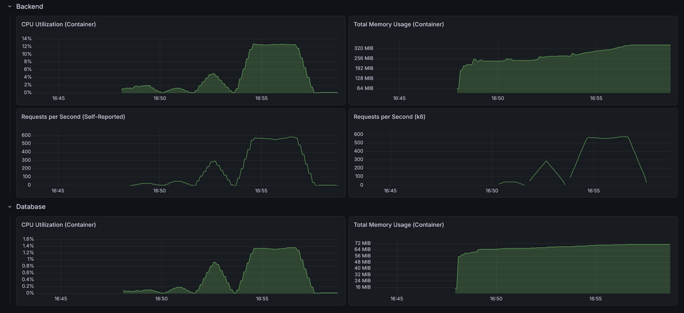
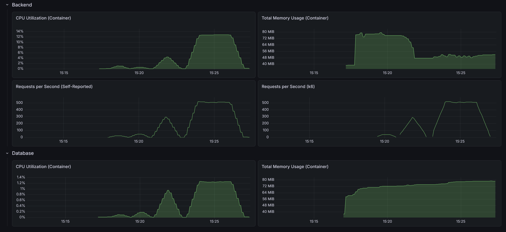

# RealWorld Backend: Java Micronaut (Vertical Slice Architecture)

This is an implementation of the [RealWorld API](https://docs.realworld.show/specs/backend-specs/introduction/) using Java and Micronaut.

## Architecture

This implementation follows a **Vertical Slice Architecture** (Package-by-Feature):

- **Feature-Centric**: Each package (e.g., `article`, `user`, `comment`) contains all the components required for that specific feature, including Controllers, Services, Mappers, and Entities.
- **High Cohesion**: Business logic, data access, and API definitions for a single domain are kept together, making features easier to find and modify in isolation.
- **Internal Simplicity**: Because the slices are granular, there is no internal sub-layering. Controllers, services, and entities live side-by-side for maximum visibility and developer productivity.
- **Cross-Cutting Concerns**: Shared infrastructure (Security, Global Exceptions, Configurations, Base Entities) resides in a specialized `core` package.

## Tech Stack

- **Java 25**
- **Micronaut 4.10.14**
- **Hibernate / JPA / Micronaut Data**
- **PostgreSQL**
- **Maven**
- **Monitoring**: Micrometer Registry OTLP, OpenTelemetry, Prometheus & Grafana integration
- **Security**: Stateless JWT Authentication via Micronaut Security JWT

## Directory Structure (Current: Granular Slices)

In this approach, slices are kept as small as possible to minimize complexity within a single package.

```text
src/
└── main/
    ├── java/
    │   └── com.sakrafux.realworld/
    │       ├── article/      # Article feature (Entity, Controller, Service, Mapper)
    │       ├── comment/      # Comment feature
    │       ├── user/         # User & Profile feature
    │       └── core/         # Shared infrastructure (Security, Exceptions)
    └── resources/            # application.yml
```

## Testing

This project prioritizes the global **API Test Suite** (located in the root `/test/api` directory) as the primary verification tool for specification compliance. 

The module contains a comprehensive suite of **Integration Tests** (`*IT.java`) using `@MicronautTest`. These tests verify the interaction between Controllers, Services, and Entities.

## Building

In order for the docker containers to be built, the jar must first be built.

### JVM

```shell
./mvnw clean package -DskipTests
```

### GraalVM

```shell
./mvnw clean package -Dpackaging=native-image -DskipTests
```

## Running Locally

Run application:
```shell
./mvnw mn:run
```

Start test resources before running tests (if running from IDE):
```shell
./mvnw mn:start-testresources-service
```

Remove test resources:
```shell
./mvnw mn:stop-testresources-service
```

## JVM Performance

- Max CPU Utilization: 12.7%
- Max Memory Usage: 344 MiB
- Max Requests per Second: 585 / 579



### API test suite

- On startup: 2.91s
- After 10 warm-up runs: 1.58s
- After load test: 1.75s

### Load test suite

#### Light load (10 VUs / 30s)

    HTTP
    http_req_duration..............: avg=7.28ms  min=568.52µs med=3.67ms  max=167.92ms p(90)=11.28ms p(95)=27.66ms
      { expected_response:true }...: avg=7.28ms  min=568.52µs med=3.67ms  max=167.92ms p(90)=11.28ms p(95)=27.66ms
      { name:AddComment }..........: avg=5.62ms  min=2.99ms   med=4.82ms  max=21.69ms  p(90)=8.16ms  p(95)=10.81ms
      { name:CreateArticle }.......: avg=17.5ms  min=3.82ms   med=10.1ms  max=99.23ms  p(90)=40.25ms p(95)=45.9ms 
      { name:DeleteArticle }.......: avg=4.04ms  min=2.04ms   med=3.12ms  max=16.34ms  p(90)=6.77ms  p(95)=8.33ms 
      { name:DeleteComment }.......: avg=4.44ms  min=1.97ms   med=3.03ms  max=26.9ms   p(90)=7.15ms  p(95)=9.78ms 
      { name:FavoriteArticle }.....: avg=5.2ms   min=2.45ms   med=4.25ms  max=20.16ms  p(90)=8.12ms  p(95)=11.59ms
      { name:FollowUser }..........: avg=5.47ms  min=2.27ms   med=3.14ms  max=87.26ms  p(90)=5.47ms  p(95)=7.81ms 
      { name:GetArticle }..........: avg=4.82ms  min=1.08ms   med=2.54ms  max=79.76ms  p(90)=6.34ms  p(95)=8.71ms 
      { name:GetArticlesFeed }.....: avg=2.14ms  min=903.84µs med=1.56ms  max=11.33ms  p(90)=4.09ms  p(95)=5.27ms 
      { name:GetComments }.........: avg=3.71ms  min=981.94µs med=2.59ms  max=21.51ms  p(90)=6.55ms  p(95)=9.74ms 
      { name:GetCurrentUser }......: avg=7.33ms  min=2.3ms    med=6.34ms  max=18.63ms  p(90)=9.76ms  p(95)=12.86ms
      { name:GetGlobalArticles }...: avg=9.61ms  min=4.92ms   med=9.03ms  max=25.06ms  p(90)=12.14ms p(95)=14.55ms
      { name:GetProfile }..........: avg=2.16ms  min=929.34µs med=1.62ms  max=12.79ms  p(90)=3.73ms  p(95)=5.5ms  
      { name:GetTags }.............: avg=1.64ms  min=568.52µs med=1.09ms  max=15.14ms  p(90)=3.59ms  p(95)=4.9ms  
      { name:Login }...............: avg=61.33ms min=56.67ms  med=60.68ms max=82.86ms  p(90)=65.24ms p(95)=70.84ms
      { name:Register }............: avg=65.48ms min=58.73ms  med=62.96ms max=167.92ms p(90)=66.03ms p(95)=68.79ms
      { name:UnfavoriteArticle }...: avg=5.11ms  min=2.39ms   med=4.07ms  max=24.7ms   p(90)=7.81ms  p(95)=9.63ms 
      { name:UnfollowUser }........: avg=3.84ms  min=2.15ms   med=3.04ms  max=54.9ms   p(90)=5.55ms  p(95)=6.67ms 
    http_req_failed................: 0.00%  0 out of 2405
    http_reqs......................: 2405   75.895308/s

    EXECUTION
    iteration_duration.............: avg=1.05s   min=1s       med=1.06s   max=1.27s    p(90)=1.08s   p(95)=1.09s  
    iterations.....................: 290    9.151617/s
    vus............................: 8      min=8         max=10
    vus_max........................: 10     min=10        max=10

    NETWORK
    data_received..................: 1.3 MB 40 kB/s
    data_sent......................: 751 kB 24 kB/s

#### Medium load (50 VUs / 1m)

    HTTP
    http_req_duration..............: avg=15.19ms min=403.82µs med=6.84ms  max=440.31ms p(90)=34.61ms  p(95)=63.29ms 
      { expected_response:true }...: avg=15.19ms min=403.82µs med=6.84ms  max=440.31ms p(90)=34.61ms  p(95)=63.29ms 
      { name:AddComment }..........: avg=12.37ms min=1.88ms   med=9.47ms  max=116.58ms p(90)=22.09ms  p(95)=30.43ms 
      { name:CreateArticle }.......: avg=33.04ms min=2.71ms   med=18.13ms max=371.37ms p(90)=76.95ms  p(95)=125.1ms 
      { name:DeleteArticle }.......: avg=8.33ms  min=1.53ms   med=5.95ms  max=110.89ms p(90)=16.48ms  p(95)=21ms    
      { name:DeleteComment }.......: avg=8.1ms   min=1.41ms   med=5.53ms  max=74.44ms  p(90)=16.24ms  p(95)=21.05ms 
      { name:FavoriteArticle }.....: avg=8.89ms  min=1.98ms   med=6.74ms  max=107.88ms p(90)=15.69ms  p(95)=20.88ms 
      { name:FollowUser }..........: avg=9.59ms  min=1.63ms   med=2.97ms  max=215.06ms p(90)=12.51ms  p(95)=59.12ms 
      { name:GetArticle }..........: avg=10.55ms min=823.74µs med=6.87ms  max=367.36ms p(90)=17.82ms  p(95)=23.32ms 
      { name:GetArticlesFeed }.....: avg=5.5ms   min=593.83µs med=3.41ms  max=95.94ms  p(90)=11.03ms  p(95)=15.96ms 
      { name:GetComments }.........: avg=8.67ms  min=785.04µs med=6.34ms  max=85.13ms  p(90)=17ms     p(95)=24ms    
      { name:GetCurrentUser }......: avg=36.43ms min=586.92µs med=11.25ms max=300.45ms p(90)=114.51ms p(95)=133.73ms
      { name:GetGlobalArticles }...: avg=11.46ms min=4.25ms   med=9.87ms  max=79.37ms  p(90)=18.18ms  p(95)=21.16ms 
      { name:GetProfile }..........: avg=19.18ms min=589.82µs med=2.36ms  max=372.36ms p(90)=60.3ms   p(95)=91.97ms 
      { name:GetTags }.............: avg=5.21ms  min=403.82µs med=3.41ms  max=75.92ms  p(90)=10.56ms  p(95)=14.4ms  
      { name:Login }...............: avg=87.85ms min=55.33ms  med=62.9ms  max=440.31ms p(90)=145.57ms p(95)=178.42ms
      { name:Register }............: avg=66.71ms min=57.22ms  med=62.77ms max=171.68ms p(90)=73.24ms  p(95)=94.87ms 
      { name:UnfavoriteArticle }...: avg=8.57ms  min=1.98ms   med=6.49ms  max=110.42ms p(90)=15.57ms  p(95)=19.78ms 
      { name:UnfollowUser }........: avg=6.66ms  min=1.46ms   med=2.75ms  max=149.23ms p(90)=12.41ms  p(95)=20.6ms  
    http_req_failed................: 0.00%  0 out of 17470
    http_reqs......................: 17470  282.630171/s

    EXECUTION
    iteration_duration.............: avg=1.09s   min=1s       med=1.07s   max=1.6s     p(90)=1.19s    p(95)=1.25s   
    iterations.....................: 2759   44.635183/s
    vus............................: 33     min=33         max=50
    vus_max........................: 50     min=50         max=50

    NETWORK
    data_received..................: 9.3 MB 150 kB/s
    data_sent......................: 5.4 MB 87 kB/s

#### Heavy load (200 VUs / 3m)

    HTTP
    http_req_duration..............: avg=148.97ms min=394.11µs med=107.53ms max=1.33s    p(90)=328.57ms p(95)=423ms   
      { expected_response:true }...: avg=148.97ms min=394.11µs med=107.53ms max=1.33s    p(90)=328.57ms p(95)=423ms   
      { name:AddComment }..........: avg=109.72ms min=1.76ms   med=85.1ms   max=900.6ms  p(90)=232.57ms p(95)=313.56ms
      { name:CreateArticle }.......: avg=283.04ms min=2.22ms   med=239.74ms max=1.28s    p(90)=547.08ms p(95)=674.56ms
      { name:DeleteArticle }.......: avg=111.36ms min=1.41ms   med=79.76ms  max=1s       p(90)=255.25ms p(95)=322.29ms
      { name:DeleteComment }.......: avg=110.15ms min=1.33ms   med=77.62ms  max=875.75ms p(90)=252.24ms p(95)=316.2ms 
      { name:FavoriteArticle }.....: avg=103.84ms min=1.8ms    med=75.96ms  max=1.12s    p(90)=226.59ms p(95)=286.95ms
      { name:FollowUser }..........: avg=165.99ms min=650.83µs med=142.85ms max=1.18s    p(90)=338.25ms p(95)=412.64ms
      { name:GetArticle }..........: avg=113.53ms min=747.13µs med=89.65ms  max=1.17s    p(90)=237.19ms p(95)=308.14ms
      { name:GetArticlesFeed }.....: avg=121.78ms min=487.32µs med=88.72ms  max=913.09ms p(90)=276.93ms p(95)=357.22ms
      { name:GetComments }.........: avg=98.51ms  min=709.13µs med=72.01ms  max=718.28ms p(90)=221.58ms p(95)=269.66ms
      { name:GetCurrentUser }......: avg=229.47ms min=462.52µs med=186.02ms max=1.33s    p(90)=473.41ms p(95)=597.53ms
      { name:GetGlobalArticles }...: avg=124.77ms min=3.79ms   med=94.49ms  max=1.01s    p(90)=276.69ms p(95)=340.23ms
      { name:GetProfile }..........: avg=182.5ms  min=542.22µs med=141.15ms max=1.16s    p(90)=398.02ms p(95)=505.47ms
      { name:GetTags }.............: avg=114.83ms min=394.11µs med=84.85ms  max=1.05s    p(90)=269.61ms p(95)=328.98ms
      { name:Login }...............: avg=246.53ms min=57.18ms  med=210.15ms max=1.23s    p(90)=438.78ms p(95)=533.74ms
      { name:Register }............: avg=208.63ms min=57.81ms  med=170.65ms max=1.04s    p(90)=381.46ms p(95)=480.5ms 
      { name:UnfavoriteArticle }...: avg=109.61ms min=1.8ms    med=81.34ms  max=1.15s    p(90)=236.25ms p(95)=307.4ms 
      { name:UnfollowUser }........: avg=123.43ms min=1.47ms   med=98.64ms  max=1.05s    p(90)=260.13ms p(95)=321.03ms
    http_req_failed................: 0.00%  0 out of 102507
    http_reqs......................: 102507 562.161801/s

    EXECUTION
    iteration_duration.............: avg=1.73s    min=1s       med=1.56s    max=5.98s    p(90)=2.52s    p(95)=2.91s   
    iterations.....................: 20867  114.437358/s
    vus............................: 70     min=70          max=200
    vus_max........................: 200    min=200         max=200

    NETWORK
    data_received..................: 55 MB  300 kB/s
    data_sent......................: 32 MB  173 kB/s

## GraalVM Performance

- Max CPU Utilization: 12.9%
- Max Memory Usage: 79.3 MiB
- Max Requests per Second: 521 / 521



### API test suite

- On startup: 1.47s
- After 10 warm-up runs: 1.60s
- After load test: 1.60s

### Load test suite

#### Light load (10 VUs / 30s)

    HTTP
    http_req_duration..............: avg=5.14ms  min=602.63µs med=2.72ms   max=121.72ms p(90)=8.12ms  p(95)=9.91ms 
      { expected_response:true }...: avg=5.14ms  min=602.63µs med=2.72ms   max=121.72ms p(90)=8.12ms  p(95)=9.91ms 
      { name:AddComment }..........: avg=3.76ms  min=2.55ms   med=3.14ms   max=13.75ms  p(90)=4.84ms  p(95)=8.94ms 
      { name:CreateArticle }.......: avg=6.82ms  min=3.33ms   med=4.68ms   max=71.77ms  p(90)=8.81ms  p(95)=11.5ms 
      { name:DeleteArticle }.......: avg=2.84ms  min=1.82ms   med=2.32ms   max=10.08ms  p(90)=3.85ms  p(95)=6.69ms 
      { name:DeleteComment }.......: avg=2.48ms  min=1.77ms   med=2.14ms   max=9.42ms   p(90)=3.59ms  p(95)=4.54ms 
      { name:FavoriteArticle }.....: avg=4.03ms  min=2.61ms   med=3.34ms   max=19.86ms  p(90)=5.4ms   p(95)=8.13ms 
      { name:FollowUser }..........: avg=3.21ms  min=1.9ms    med=2.61ms   max=11.85ms  p(90)=5.01ms  p(95)=6.47ms 
      { name:GetArticle }..........: avg=2.12ms  min=1.26ms   med=1.6ms    max=10.52ms  p(90)=3.03ms  p(95)=6.09ms 
      { name:GetArticlesFeed }.....: avg=2.12ms  min=654.33µs med=1.11ms   max=13.69ms  p(90)=4.93ms  p(95)=5.61ms 
      { name:GetComments }.........: avg=1.95ms  min=1.12ms   med=1.44ms   max=10.07ms  p(90)=3.51ms  p(95)=3.96ms 
      { name:GetCurrentUser }......: avg=1.06ms  min=793.04µs med=1.03ms   max=1.57ms   p(90)=1.22ms  p(95)=1.38ms 
      { name:GetGlobalArticles }...: avg=8.68ms  min=7.07ms   med=8.23ms   max=18.57ms  p(90)=9.8ms   p(95)=11.69ms
      { name:GetProfile }..........: avg=2.21ms  min=804.54µs med=1.31ms   max=67.43ms  p(90)=2.72ms  p(95)=4ms    
      { name:GetTags }.............: avg=1.31ms  min=602.63µs med=801.03µs max=15.73ms  p(90)=2.66ms  p(95)=4.07ms 
      { name:Login }...............: avg=62.38ms min=57.01ms  med=60.52ms  max=121.72ms p(90)=63.17ms p(95)=66.45ms
      { name:Register }............: avg=62.32ms min=58.43ms  med=62.66ms  max=68.73ms  p(90)=66.28ms p(95)=67.54ms
      { name:UnfavoriteArticle }...: avg=3.89ms  min=2.24ms   med=3.29ms   max=16.33ms  p(90)=5.34ms  p(95)=7.82ms 
      { name:UnfollowUser }........: avg=2.8ms   min=1.93ms   med=2.41ms   max=10.07ms  p(90)=4.03ms  p(95)=4.97ms 
    http_req_failed................: 0.00%  0 out of 2428
    http_reqs......................: 2428   77.029867/s

    EXECUTION
    iteration_duration.............: avg=1.04s   min=1s       med=1.04s    max=1.14s    p(90)=1.06s   p(95)=1.06s  
    iterations.....................: 292    9.263888/s
    vus............................: 6      min=6         max=10
    vus_max........................: 10     min=10        max=10

    NETWORK
    data_received..................: 1.3 MB 40 kB/s
    data_sent......................: 759 kB 24 kB/s

#### Medium load (50 VUs / 1m)

    HTTP
    http_req_duration..............: avg=13.72ms min=514.52µs med=7.09ms  max=293.33ms p(90)=30.34ms  p(95)=59.83ms 
      { expected_response:true }...: avg=13.72ms min=514.52µs med=7.09ms  max=293.33ms p(90)=30.34ms  p(95)=59.83ms 
      { name:AddComment }..........: avg=10.69ms min=2.24ms   med=8.6ms   max=62ms     p(90)=21.27ms  p(95)=25.42ms 
      { name:CreateArticle }.......: avg=25.28ms min=2.54ms   med=16.3ms  max=292.36ms p(90)=60.21ms  p(95)=74.56ms 
      { name:DeleteArticle }.......: avg=8.53ms  min=1.62ms   med=5.84ms  max=78.66ms  p(90)=15.51ms  p(95)=21.34ms 
      { name:DeleteComment }.......: avg=8.22ms  min=1.46ms   med=5.58ms  max=87.3ms   p(90)=16.62ms  p(95)=22.51ms 
      { name:FavoriteArticle }.....: avg=9.38ms  min=2.13ms   med=7.02ms  max=98.9ms   p(90)=17.43ms  p(95)=21.82ms 
      { name:FollowUser }..........: avg=11.64ms min=1.67ms   med=3.23ms  max=162.04ms p(90)=22.95ms  p(95)=63.97ms 
      { name:GetArticle }..........: avg=10.05ms min=1ms      med=6.54ms  max=231.25ms p(90)=18.14ms  p(95)=22.03ms 
      { name:GetArticlesFeed }.....: avg=5.6ms   min=628.22µs med=3.67ms  max=71.06ms  p(90)=11.38ms  p(95)=15.7ms  
      { name:GetComments }.........: avg=8.34ms  min=987.24µs med=6.03ms  max=75.77ms  p(90)=17.15ms  p(95)=20.02ms 
      { name:GetCurrentUser }......: avg=18.66ms min=531.72µs med=4.18ms  max=236.88ms p(90)=67.32ms  p(95)=84.79ms 
      { name:GetGlobalArticles }...: avg=12.51ms min=4.8ms    med=10.65ms max=84.39ms  p(90)=19.39ms  p(95)=23.3ms  
      { name:GetProfile }..........: avg=20.94ms min=719.73µs med=3.15ms  max=293.33ms p(90)=57.09ms  p(95)=70.88ms 
      { name:GetTags }.............: avg=5.31ms  min=514.52µs med=3.54ms  max=68.13ms  p(90)=11.9ms   p(95)=13.74ms 
      { name:Login }...............: avg=72.11ms min=56.25ms  med=60.38ms max=291.49ms p(90)=114.77ms p(95)=132.88ms
      { name:Register }............: avg=65.27ms min=57.8ms   med=61.63ms max=277.32ms p(90)=68.11ms  p(95)=74.35ms 
      { name:UnfavoriteArticle }...: avg=9.03ms  min=2.11ms   med=6.79ms  max=69.57ms  p(90)=16.3ms   p(95)=19.33ms 
      { name:UnfollowUser }........: avg=6.05ms  min=1.53ms   med=2.99ms  max=80.1ms   p(90)=15.34ms  p(95)=22.03ms 
    http_req_failed................: 0.00%  0 out of 17632
    http_reqs......................: 17632  285.692219/s

    EXECUTION
    iteration_duration.............: avg=1.08s   min=1s       med=1.06s   max=1.43s    p(90)=1.17s    p(95)=1.19s   
    iterations.....................: 2782   45.076892/s
    vus............................: 30     min=30         max=50
    vus_max........................: 50     min=50         max=50

    NETWORK
    data_received..................: 9.3 MB 151 kB/s
    data_sent......................: 5.4 MB 88 kB/s

#### Heavy load (200 VUs / 3m)

    HTTP
    http_req_duration..............: avg=180.47ms min=480.92µs med=148.26ms max=1.16s    p(90)=371.42ms p(95)=451.03ms
      { expected_response:true }...: avg=180.47ms min=480.92µs med=148.26ms max=1.16s    p(90)=371.42ms p(95)=451.03ms
      { name:AddComment }..........: avg=145.24ms min=2.16ms   med=112.12ms max=702.17ms p(90)=297.2ms  p(95)=363.6ms 
      { name:CreateArticle }.......: avg=320.31ms min=2.87ms   med=292.56ms max=1.1s     p(90)=562.82ms p(95)=651.89ms
      { name:DeleteArticle }.......: avg=144.01ms min=1.61ms   med=109.85ms max=782.98ms p(90)=308.45ms p(95)=375.1ms 
      { name:DeleteComment }.......: avg=138.59ms min=1.62ms   med=108.08ms max=730.99ms p(90)=295.76ms p(95)=351.59ms
      { name:FavoriteArticle }.....: avg=133.36ms min=2.22ms   med=105.39ms max=689.37ms p(90)=270.86ms p(95)=331.48ms
      { name:FollowUser }..........: avg=192.13ms min=1.68ms   med=172.3ms  max=896.16ms p(90)=370.78ms p(95)=440.5ms 
      { name:GetArticle }..........: avg=146.01ms min=888.03µs med=115.77ms max=1.05s    p(90)=299.73ms p(95)=357.95ms
      { name:GetArticlesFeed }.....: avg=160.36ms min=588.62µs med=132.21ms max=786.88ms p(90)=332.3ms  p(95)=396.27ms
      { name:GetComments }.........: avg=130.49ms min=875.73µs med=100.32ms max=734.28ms p(90)=274.36ms p(95)=331.12ms
      { name:GetCurrentUser }......: avg=234.1ms  min=590.62µs med=202.45ms max=972.66ms p(90)=449.61ms p(95)=546.18ms
      { name:GetGlobalArticles }...: avg=157.77ms min=4.89ms   med=127.42ms max=943.91ms p(90)=323.33ms p(95)=394.24ms
      { name:GetProfile }..........: avg=210.57ms min=728.93µs med=187.1ms  max=1.1s     p(90)=408.07ms p(95)=477.37ms
      { name:GetTags }.............: avg=146.15ms min=480.92µs med=113.32ms max=797.86ms p(90)=315.18ms p(95)=392.19ms
      { name:Login }...............: avg=253.56ms min=59.39ms  med=229.37ms max=1.16s    p(90)=430.12ms p(95)=499.4ms 
      { name:Register }............: avg=266.51ms min=60.13ms  med=243.6ms  max=908.69ms p(90)=460.09ms p(95)=522.84ms
      { name:UnfavoriteArticle }...: avg=138.27ms min=2.08ms   med=109.42ms max=663.77ms p(90)=289.18ms p(95)=348.6ms 
      { name:UnfollowUser }........: avg=157.95ms min=1.56ms   med=128.21ms max=828.56ms p(90)=320.33ms p(95)=382.75ms
    http_req_failed................: 0.00% 0 out of 92881
    http_reqs......................: 92881 510.007457/s

    EXECUTION
    iteration_duration.............: avg=1.86s    min=1s       med=1.65s    max=6s       p(90)=2.87s    p(95)=3.23s   
    iterations.....................: 19352 106.261392/s
    vus............................: 44    min=44         max=200
    vus_max........................: 200   min=200        max=200

    NETWORK
    data_received..................: 50 MB 272 kB/s
    data_sent......................: 29 MB 157 kB/s
