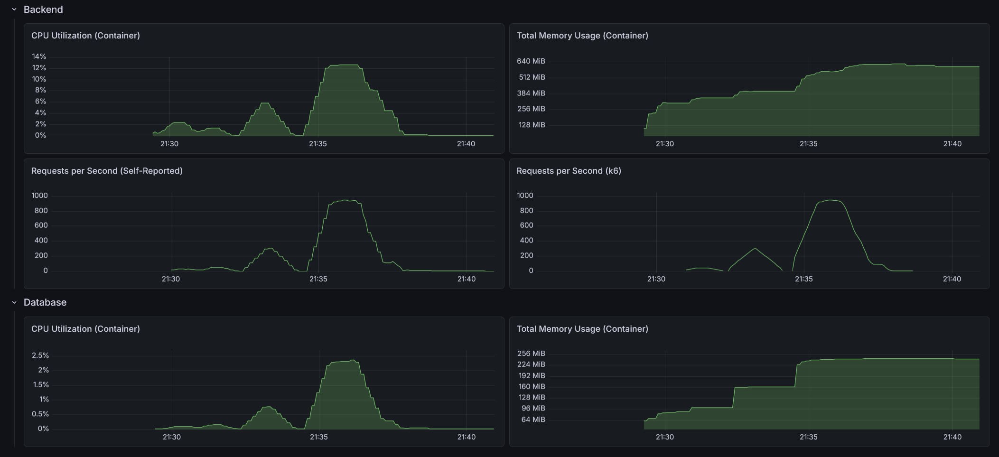
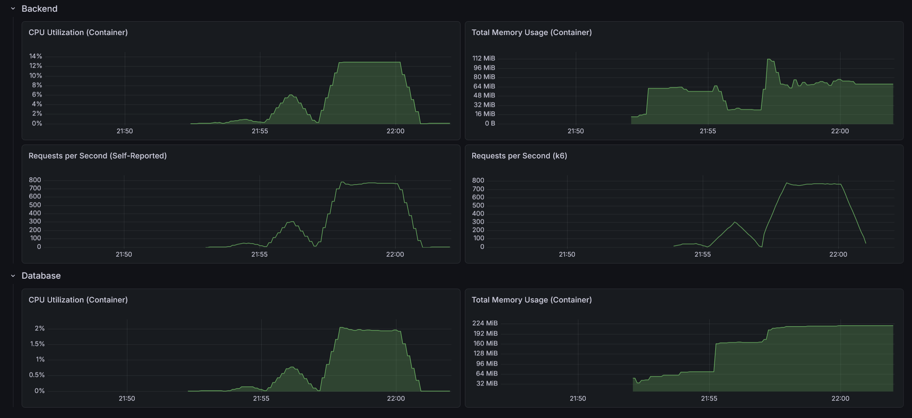

# RealWorld Backend: Java Quarkus (Vertical Slice Architecture)

This is an implementation of the [RealWorld API](https://docs.realworld.show/specs/backend-specs/introduction/) using Java and Quarkus.

## Architecture

This implementation follows a **Vertical Slice Architecture** (Package-by-Feature) combined with the **Active Record Pattern**:

- **Feature-Centric**: Each package (e.g., `article`, `user`, `comment`) contains all the components required for that specific feature, including REST Resources, Services, Mappers, and Entities.
- **Active Record (Panache)**: By leveraging **Hibernate Panache**, business entities extend `PanacheEntityBase`. This combines data and persistence logic, significantly reducing boilerplate code while maintaining high performance.
- **High Cohesion**: Business logic, data access, and API definitions for a single domain are kept together, making features easier to find and modify in isolation.
- **Internal Simplicity**: Because the slices are granular, there is no internal sub-layering. Resources, services, and entities live side-by-side for maximum visibility and developer productivity.
- **Cross-Cutting Concerns**: Shared infrastructure (Security, Global Exceptions, Configurations, Base Entities) resides in a specialized `core` package.

## Tech Stack

- **Java 25**
- **Quarkus 3.35.2**
- **Hibernate Panache** (Active Record Pattern)
- **H2 / PostgreSQL** (depending on configuration)
- **Maven**
- **Monitoring**: Micrometer Registry OTLP, OpenTelemetry, Prometheus & Grafana integration
- **Security**: Stateless JWT Authentication via SmallRye JWT

## Directory Structure (Current: Granular Slices)

In this approach, slices are kept as small as possible to minimize complexity within a single package.

```text
src/
└── main/
    ├── java/
    │   └── com.sakrafux.realworld/
    │       ├── article/      # Article feature (Entity, Resource, Service, Mapper)
    │       ├── comment/      # Comment feature
    │       ├── user/         # User & Profile feature
    │       └── core/         # Shared infrastructure (Security, Exceptions)
    └── resources/            # application.yml
```

## Testing

This project prioritizes the global **API Test Suite** (located in the root `/test/api` directory) as the primary verification tool for specification compliance. 

The module contains a comprehensive suite of **Integration Tests** (`*IT.java`) using `@QuarkusTest`. These tests verify the interaction between Resources, Services, and Panache Entities. Native build verification is supported via `@QuarkusIntegrationTest`.

## Building

In order for the docker containers to be built, the jar (or native image) must first be built. Because Quarkus 
locks the DB at build time, this cannot be overwritten using environment variables. The same goes for OpenTelemetry.

Overall, one must be careful with Quarkus and build/run time settings.

### JVM

```shell
./mvnw clean package "-Dquarkus.datasource.db-kind=postgresql" "-Dquarkus.otel.enabled=true" -DskipTests
```

### GraalVM

```shell
./mvnw clean package -Pnative "-Dquarkus.native.container-build=true" "-Dquarkus.datasource.db-kind=postgresql" "-Dquarkus.otel.enabled=true" -DskipTests
```

## JVM Performance

- Max CPU Utilization: 12.7%
- Max Memory Usage: 624 MiB
- Max Requests per Second: 943 / 949



### API test suite

- On startup: 2.32s
- After 10 warm-up runs: 1.12s
- After load test: 1.05s

### Load test suite

#### Light load (10 VUs / 30s)

    HTTP
    http_req_duration..............: avg=6.06ms  min=570.32µs med=3.47ms   max=169.73ms p(90)=6.49ms  p(95)=10.15ms
      { expected_response:true }...: avg=6ms     min=570.32µs med=3.45ms   max=169.73ms p(90)=6.39ms  p(95)=9.87ms 
      { name:AddComment }..........: avg=4.83ms  min=2.96ms   med=4.21ms   max=20.67ms  p(90)=6.24ms  p(95)=7.89ms 
      { name:CreateArticle }.......: avg=7.81ms  min=3.92ms   med=5.64ms   max=124.86ms p(90)=9.21ms  p(95)=16.15ms
      { name:DeleteArticle }.......: avg=3.68ms  min=2.32ms   med=3.25ms   max=40.9ms   p(90)=4.45ms  p(95)=5.18ms 
      { name:DeleteComment }.......: avg=3.45ms  min=2.27ms   med=3.09ms   max=11.3ms   p(90)=4.73ms  p(95)=6.15ms 
      { name:FavoriteArticle }.....: avg=4.96ms  min=3.25ms   med=4.36ms   max=23.96ms  p(90)=6.33ms  p(95)=8.37ms 
      { name:FollowUser }..........: avg=4.98ms  min=2.53ms   med=3.59ms   max=78.1ms   p(90)=6.61ms  p(95)=8.73ms 
      { name:GetArticle }..........: avg=2.01ms  min=1.24ms   med=1.79ms   max=10.1ms   p(90)=2.48ms  p(95)=3.19ms 
      { name:GetArticlesFeed }.....: avg=1.47ms  min=778.53µs med=1.21ms   max=10.79ms  p(90)=1.79ms  p(95)=2.63ms 
      { name:GetComments }.........: avg=2ms     min=1.01ms   med=1.62ms   max=9.82ms   p(90)=2.56ms  p(95)=3.8ms  
      { name:GetCurrentUser }......: avg=1.89ms  min=1.29ms   med=1.76ms   max=3.4ms    p(90)=2.29ms  p(95)=2.46ms 
      { name:GetGlobalArticles }...: avg=5.45ms  min=3.16ms   med=4.64ms   max=25.49ms  p(90)=6.82ms  p(95)=9.78ms 
      { name:GetProfile }..........: avg=1.83ms  min=1ms      med=1.43ms   max=11.2ms   p(90)=2.43ms  p(95)=3.71ms 
      { name:GetTags }.............: avg=1.16ms  min=570.32µs med=938.78µs max=8.64ms   p(90)=1.5ms   p(95)=1.96ms 
      { name:Login }...............: avg=85.42ms min=77.54ms  med=79.49ms  max=169.73ms p(90)=94.25ms p(95)=114.9ms
      { name:Register }............: avg=86.03ms min=78.53ms  med=82.15ms  max=160.64ms p(90)=89.28ms p(95)=96.09ms
      { name:UnfavoriteArticle }...: avg=4.99ms  min=3.01ms   med=4.21ms   max=39.94ms  p(90)=6.69ms  p(95)=8.21ms 
      { name:UnfollowUser }........: avg=4.34ms  min=2.44ms   med=3.47ms   max=36.57ms  p(90)=5.73ms  p(95)=9.11ms 
    http_req_failed................: 0.25%  6 out of 2397
    http_reqs......................: 2397   75.266088/s

    EXECUTION
    iteration_duration.............: avg=1.04s   min=1s       med=1.04s    max=1.2s     p(90)=1.08s   p(95)=1.09s  
    iterations.....................: 292    9.168835/s
    vus............................: 10     min=10        max=10
    vus_max........................: 10     min=10        max=10

    NETWORK
    data_received..................: 1.3 MB 40 kB/s
    data_sent......................: 862 kB 27 kB/s

#### Medium load (50 VUs / 1m)

    HTTP
    http_req_duration..............: avg=6.89ms  min=343.11µs med=2.51ms   max=614.76ms p(90)=5.54ms  p(95)=13.1ms  
      { expected_response:true }...: avg=6.89ms  min=343.11µs med=2.51ms   max=614.76ms p(90)=5.54ms  p(95)=13.12ms 
      { name:AddComment }..........: avg=3.82ms  min=1.87ms   med=3.15ms   max=54.66ms  p(90)=4.7ms   p(95)=6.43ms  
      { name:CreateArticle }.......: avg=7.29ms  min=2.6ms    med=4.2ms    max=500.95ms p(90)=7.12ms  p(95)=9.65ms  
      { name:DeleteArticle }.......: avg=2.99ms  min=1.56ms   med=2.44ms   max=26.72ms  p(90)=4.17ms  p(95)=5.85ms  
      { name:DeleteComment }.......: avg=3.18ms  min=1.39ms   med=2.21ms   max=389.74ms p(90)=3.3ms   p(95)=4.74ms  
      { name:FavoriteArticle }.....: avg=4.11ms  min=1.82ms   med=3.15ms   max=442.57ms p(90)=5.2ms   p(95)=7.15ms  
      { name:FollowUser }..........: avg=3.31ms  min=1.35ms   med=2.59ms   max=70.05ms  p(90)=4.14ms  p(95)=6.2ms   
      { name:GetArticle }..........: avg=2.61ms  min=635.82µs med=1.29ms   max=402.72ms p(90)=2.01ms  p(95)=3.15ms  
      { name:GetArticlesFeed }.....: avg=1.15ms  min=453.11µs med=804.68µs max=20.07ms  p(90)=1.49ms  p(95)=2.8ms   
      { name:GetComments }.........: avg=1.85ms  min=626.42µs med=1.14ms   max=403.6ms  p(90)=1.82ms  p(95)=3.09ms  
      { name:GetCurrentUser }......: avg=1.55ms  min=612.62µs med=1.14ms   max=18.63ms  p(90)=2.24ms  p(95)=3.84ms  
      { name:GetGlobalArticles }...: avg=4.04ms  min=1.89ms   med=3.48ms   max=25.5ms   p(90)=5.5ms   p(95)=7.66ms  
      { name:GetProfile }..........: avg=2.24ms  min=524.62µs med=1.04ms   max=459.4ms  p(90)=1.93ms  p(95)=2.82ms  
      { name:GetTags }.............: avg=1.16ms  min=343.11µs med=608.12µs max=431.18ms p(90)=1.07ms  p(95)=1.7ms   
      { name:Login }...............: avg=95.12ms min=76.26ms  med=79.69ms  max=561.85ms p(90)=98.99ms p(95)=160.08ms
      { name:Register }............: avg=92.14ms min=78.16ms  med=81.81ms  max=614.76ms p(90)=94.2ms  p(95)=113.51ms
      { name:UnfavoriteArticle }...: avg=4.01ms  min=1.88ms   med=3.05ms   max=428.71ms p(90)=5.17ms  p(95)=7.37ms  
      { name:UnfollowUser }........: avg=4.14ms  min=917.64µs med=2.46ms   max=481.7ms  p(90)=4.07ms  p(95)=5.8ms   
    http_req_failed................: 0.07%  13 out of 18569
    http_reqs......................: 18569  299.921801/s

    EXECUTION
    iteration_duration.............: avg=1.04s   min=1s       med=1.02s    max=1.63s    p(90)=1.08s   p(95)=1.09s   
    iterations.....................: 2897   46.791613/s
    vus............................: 47     min=47          max=50
    vus_max........................: 50     min=50          max=50

    NETWORK
    data_received..................: 10 MB  162 kB/s
    data_sent......................: 6.6 MB 107 kB/s

#### Heavy load (200 VUs / 3m)

    HTTP
    http_req_duration..............: avg=205.38ms min=305.41µs med=13.08ms  max=59.99s p(90)=104.52ms p(95)=324.09ms
      { expected_response:true }...: avg=94.09ms  min=305.41µs med=12.99ms  max=38.53s p(90)=101.17ms p(95)=300.23ms
      { name:AddComment }..........: avg=88.2ms   min=1.69ms   med=19.1ms   max=59.99s p(90)=88.59ms  p(95)=146.94ms
      { name:CreateArticle }.......: avg=172.41ms min=1.96ms   med=29.23ms  max=59.99s p(90)=142.73ms p(95)=241.8ms 
      { name:DeleteArticle }.......: avg=98.23ms  min=1.42ms   med=12.34ms  max=59.99s p(90)=58.57ms  p(95)=100.93ms
      { name:DeleteComment }.......: avg=70.74ms  min=1.09ms   med=11.34ms  max=59.99s p(90)=48.72ms  p(95)=85.15ms 
      { name:FavoriteArticle }.....: avg=109.78ms min=1.77ms   med=15.63ms  max=59.99s p(90)=65.82ms  p(95)=120.65ms
      { name:FollowUser }..........: avg=577.33ms min=775.83µs med=11.69ms  max=59.99s p(90)=50.04ms  p(95)=86.52ms 
      { name:GetArticle }..........: avg=97ms     min=674.72µs med=7.56ms   max=49.1s  p(90)=64.56ms  p(95)=160.66ms
      { name:GetArticlesFeed }.....: avg=71.42ms  min=380.81µs med=8ms      max=52.59s p(90)=49.45ms  p(95)=90.7ms  
      { name:GetComments }.........: avg=111.45ms min=551.42µs med=6.51ms   max=59.99s p(90)=43.39ms  p(95)=87ms    
      { name:GetCurrentUser }......: avg=373.71ms min=508.62µs med=10.95ms  max=59.99s p(90)=223.49ms p(95)=428.25ms
      { name:GetGlobalArticles }...: avg=171.68ms min=1.88ms   med=16.51ms  max=59.99s p(90)=89.52ms  p(95)=191.03ms
      { name:GetProfile }..........: avg=58.65ms  min=526.22µs med=7.42ms   max=59.99s p(90)=46.78ms  p(95)=82.34ms 
      { name:GetTags }.............: avg=63.75ms  min=305.41µs med=5.02ms   max=59.99s p(90)=36.01ms  p(95)=68.3ms  
      { name:Login }...............: avg=1.52s    min=77.61ms  med=994.89ms max=59.99s p(90)=1.63s    p(95)=1.8s    
      { name:Register }............: avg=1.86s    min=79.05ms  med=1.01s    max=59.99s p(90)=1.65s    p(95)=1.8s    
      { name:UnfavoriteArticle }...: avg=116.44ms min=1.72ms   med=15.8ms   max=59.99s p(90)=67.78ms  p(95)=110.17ms
      { name:UnfollowUser }........: avg=474.63ms min=955.14µs med=11.72ms  max=59.99s p(90)=52.41ms  p(95)=93.14ms 
    http_req_failed................: 0.55%  582 out of 105277
    http_reqs......................: 105277 499.319939/s

    EXECUTION
    iteration_duration.............: avg=2.21s    min=1s       med=1.18s    max=1m39s  p(90)=2.3s     p(95)=2.64s   
    iterations.....................: 17406  82.555191/s
    vus............................: 30     min=0             max=200
    vus_max........................: 200    min=200           max=200

    NETWORK
    data_received..................: 57 MB  271 kB/s
    data_sent......................: 37 MB  177 kB/s

> This load test breaks the application → doesn't work afterward

## GraalVM Performance

- Max CPU Utilization: 13%
- Max Memory Usage: 112 MiB
- Max Requests per Second: 780 / 782



### API test suite

- On startup: 1.21s
- After 10 warm-up runs: 1.18s
- After load test: 1.18s

### Load test suite

#### Light load (10 VUs / 30s)

    HTTP
    http_req_duration..............: avg=5.24ms   min=452.62µs med=2.71ms   max=141.78ms p(90)=4.64ms   p(95)=6.31ms  
      { expected_response:true }...: avg=5.23ms   min=452.62µs med=2.7ms    max=141.78ms p(90)=4.62ms   p(95)=6.21ms  
      { name:AddComment }..........: avg=3.42ms   min=2.41ms   med=3.28ms   max=7.69ms   p(90)=3.94ms   p(95)=4.26ms  
      { name:CreateArticle }.......: avg=5.61ms   min=3.39ms   med=4.67ms   max=42.61ms  p(90)=7.45ms   p(95)=9.16ms  
      { name:DeleteArticle }.......: avg=2.85ms   min=2.09ms   med=2.61ms   max=17.31ms  p(90)=3.32ms   p(95)=3.92ms  
      { name:DeleteComment }.......: avg=2.55ms   min=1.74ms   med=2.39ms   max=10.28ms  p(90)=2.95ms   p(95)=3.38ms  
      { name:FavoriteArticle }.....: avg=3.63ms   min=2.64ms   med=3.48ms   max=8.43ms   p(90)=4.2ms    p(95)=4.4ms   
      { name:FollowUser }..........: avg=3.24ms   min=1.83ms   med=2.78ms   max=6.67ms   p(90)=5.81ms   p(95)=6.14ms  
      { name:GetArticle }..........: avg=1.6ms    min=963.46µs med=1.51ms   max=10.21ms  p(90)=1.9ms    p(95)=2.17ms  
      { name:GetArticlesFeed }.....: avg=1.03ms   min=611.43µs med=935.46µs max=3.95ms   p(90)=1.22ms   p(95)=1.57ms  
      { name:GetComments }.........: avg=1.37ms   min=841.65µs med=1.32ms   max=2.9ms    p(90)=1.64ms   p(95)=1.81ms  
      { name:GetCurrentUser }......: avg=1.22ms   min=785.74µs med=1.21ms   max=1.94ms   p(90)=1.48ms   p(95)=1.65ms  
      { name:GetGlobalArticles }...: avg=4ms      min=2.65ms   med=3.9ms    max=7.76ms   p(90)=4.54ms   p(95)=5.13ms  
      { name:GetProfile }..........: avg=1.34ms   min=752.04µs med=1.16ms   max=4.96ms   p(90)=1.96ms   p(95)=2.2ms   
      { name:GetTags }.............: avg=769.79µs min=452.62µs med=653.74µs max=9.36ms   p(90)=882.5µs  p(95)=1.05ms  
      { name:Login }...............: avg=90.7ms   min=85.65ms  med=89.6ms   max=106.74ms p(90)=94.6ms   p(95)=98.53ms 
      { name:Register }............: avg=96.25ms  min=87.1ms   med=93.84ms  max=141.78ms p(90)=104.42ms p(95)=108.88ms
      { name:UnfavoriteArticle }...: avg=3.56ms   min=2.42ms   med=3.4ms    max=7.11ms   p(90)=4.12ms   p(95)=4.79ms  
      { name:UnfollowUser }........: avg=2.84ms   min=1.25ms   med=2.68ms   max=7.46ms   p(90)=3.4ms    p(95)=3.96ms  
    http_req_failed................: 0.37%  9 out of 2397
    http_reqs......................: 2397   75.52639/s

    EXECUTION
    iteration_duration.............: avg=1.04s    min=1s       med=1.03s    max=1.14s    p(90)=1.09s    p(95)=1.09s   
    iterations.....................: 292    9.200545/s
    vus............................: 10     min=0         max=10
    vus_max........................: 10     min=10        max=10

    NETWORK
    data_received..................: 1.2 MB 39 kB/s
    data_sent......................: 862 kB 27 kB/s

#### Medium load (50 VUs / 1m)

    HTTP
    http_req_duration..............: avg=7.94ms   min=34.4µs   med=2.82ms   max=582.87ms p(90)=6.43ms   p(95)=16.18ms 
      { expected_response:true }...: avg=7.94ms   min=34.4µs   med=2.82ms   max=582.87ms p(90)=6.42ms   p(95)=16.19ms 
      { name:AddComment }..........: avg=5.43ms   min=2.11ms   med=3.41ms   max=573.76ms p(90)=6.4ms    p(95)=8.65ms  
      { name:CreateArticle }.......: avg=9.66ms   min=2.55ms   med=4.6ms    max=582.87ms p(90)=9.19ms   p(95)=14.23ms 
      { name:DeleteArticle }.......: avg=3.44ms   min=1.72ms   med=2.69ms   max=31.64ms  p(90)=4.88ms   p(95)=6.84ms  
      { name:DeleteComment }.......: avg=3.06ms   min=1.56ms   med=2.41ms   max=24.6ms   p(90)=4.2ms    p(95)=5.99ms  
      { name:FavoriteArticle }.....: avg=4.84ms   min=2.22ms   med=3.55ms   max=470.6ms  p(90)=6.26ms   p(95)=9.27ms  
      { name:FollowUser }..........: avg=4.94ms   min=1.07ms   med=2.83ms   max=562.23ms p(90)=4.49ms   p(95)=6.2ms   
      { name:GetArticle }..........: avg=3.51ms   min=824.34µs med=1.51ms   max=582.61ms p(90)=2.72ms   p(95)=4.03ms  
      { name:GetArticlesFeed }.....: avg=1.23ms   min=554.13µs med=928.85µs max=11.07ms  p(90)=1.88ms   p(95)=2.79ms  
      { name:GetComments }.........: avg=2.32ms   min=286.92µs med=1.32ms   max=553.54ms p(90)=2.59ms   p(95)=4.24ms  
      { name:GetCurrentUser }......: avg=1.52ms   min=722.84µs med=1.18ms   max=14.16ms  p(90)=2.3ms    p(95)=3.42ms  
      { name:GetGlobalArticles }...: avg=4.65ms   min=2.3ms    med=3.94ms   max=29.78ms  p(90)=6.38ms   p(95)=8.68ms  
      { name:GetProfile }..........: avg=3.13ms   min=702.14µs med=1.25ms   max=538.36ms p(90)=2.31ms   p(95)=3.8ms   
      { name:GetTags }.............: avg=860.79µs min=34.4µs   med=671.48µs max=11.51ms  p(90)=1.13ms   p(95)=1.66ms  
      { name:Login }...............: avg=104.94ms min=84.66ms  med=94.12ms  max=537.56ms p(90)=118.98ms p(95)=133.85ms
      { name:Register }............: avg=100.88ms min=87.29ms  med=94.77ms  max=311.83ms p(90)=110.24ms p(95)=120.46ms
      { name:UnfavoriteArticle }...: avg=4.27ms   min=2.17ms   med=3.5ms    max=38.24ms  p(90)=6.23ms   p(95)=8.6ms   
      { name:UnfollowUser }........: avg=4ms      min=1.07ms   med=2.71ms   max=535.47ms p(90)=4.8ms    p(95)=6.82ms  
    http_req_failed................: 0.07%  13 out of 18361
    http_reqs......................: 18361  295.679648/s

    EXECUTION
    iteration_duration.............: avg=1.05s    min=1s       med=1.03s    max=1.7s     p(90)=1.1s     p(95)=1.11s   
    iterations.....................: 2873   46.265869/s
    vus............................: 3      min=0           max=50
    vus_max........................: 50     min=50          max=50

    NETWORK
    data_received..................: 9.6 MB 155 kB/s
    data_sent......................: 6.5 MB 105 kB/s

#### Heavy load (200 VUs / 3m)

    HTTP
    http_req_duration..............: avg=95.35ms  min=362.52µs med=19.48ms max=3.65s    p(90)=204.14ms p(95)=325.02ms
      { expected_response:true }...: avg=95.39ms  min=362.52µs med=19.42ms max=3.65s    p(90)=204.15ms p(95)=325.34ms
      { name:AddComment }..........: avg=76.83ms  min=1.97ms   med=31.1ms  max=1.32s    p(90)=212.44ms p(95)=277.94ms
      { name:CreateArticle }.......: avg=120.73ms min=1.37ms   med=78.15ms max=1.95s    p(90)=284.44ms p(95)=361.83ms
      { name:DeleteArticle }.......: avg=46.82ms  min=1.66ms   med=16.45ms max=618.51ms p(90)=150.33ms p(95)=208.3ms 
      { name:DeleteComment }.......: avg=43.98ms  min=1.43ms   med=15.26ms max=596.09ms p(90)=144.24ms p(95)=198.63ms
      { name:FavoriteArticle }.....: avg=59.74ms  min=2.2ms    med=22.53ms max=1.19s    p(90)=178.8ms  p(95)=232.57ms
      { name:FollowUser }..........: avg=44.82ms  min=947.35µs med=16.53ms max=1.35s    p(90)=139.87ms p(95)=194.81ms
      { name:GetArticle }..........: avg=41.51ms  min=861.25µs med=13.12ms max=1.51s    p(90)=131.63ms p(95)=193.55ms
      { name:GetArticlesFeed }.....: avg=35.14ms  min=513.72µs med=11.51ms max=598.32ms p(90)=117.68ms p(95)=175.19ms
      { name:GetComments }.........: avg=36.3ms   min=744.84µs med=11.3ms  max=834.32ms p(90)=123.49ms p(95)=182.42ms
      { name:GetCurrentUser }......: avg=35.21ms  min=635.04µs med=12.41ms max=483.92ms p(90)=118.26ms p(95)=169.76ms
      { name:GetGlobalArticles }...: avg=64.1ms   min=2.69ms   med=25.8ms  max=718.78ms p(90)=188.41ms p(95)=242.16ms
      { name:GetProfile }..........: avg=50.92ms  min=512.52µs med=14.91ms max=1.19s    p(90)=152.74ms p(95)=213.9ms 
      { name:GetTags }.............: avg=26.6ms   min=362.52µs med=7.49ms  max=484.19ms p(90)=84.29ms  p(95)=149.85ms
      { name:Login }...............: avg=1.26s    min=150.17ms med=1.25s   max=3.65s    p(90)=1.8s     p(95)=1.97s   
      { name:Register }............: avg=1.24s    min=88.71ms  med=1.23s   max=2.57s    p(90)=1.79s    p(95)=1.94s   
      { name:UnfavoriteArticle }...: avg=57.44ms  min=2.2ms    med=22.03ms max=657.76ms p(90)=173.51ms p(95)=226.25ms
      { name:UnfollowUser }........: avg=45.2ms   min=1.22ms   med=16.2ms  max=842.65ms p(90)=144.5ms  p(95)=199.47ms
    http_req_failed................: 0.39%  545 out of 137951
    http_reqs......................: 137951 755.708623/s

    EXECUTION
    iteration_duration.............: avg=1.57s    min=1s       med=1.41s   max=4.68s    p(90)=2.34s    p(95)=2.61s   
    iterations.....................: 22981  125.892091/s
    vus............................: 100    min=0             max=200
    vus_max........................: 200    min=200           max=200

    NETWORK
    data_received..................: 73 MB  397 kB/s
    data_sent......................: 49 MB  269 kB/s
