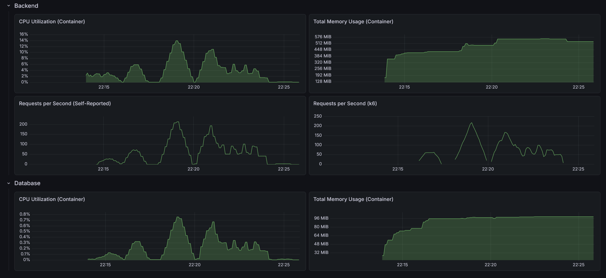

# RealWorld Backend: Java Spring Boot (Hexagonal Architecture)

This is an implementation of the [RealWorld API](https://docs.realworld.show/specs/backend-specs/introduction/) using Java, Spring Boot, and **Hexagonal Architecture** (also known as Ports and Adapters).

## Architecture

This implementation strictly separates business logic from technical concerns using the Hexagonal pattern:

- **Domain Layer**: The core of the application. Contains pure Java POJOs (Models) and business logic. It has zero dependencies on external frameworks or other layers.
- **Application Layer**: Orchestrates domain objects to fulfill use cases.
    - **Input Ports (Use Cases/Queries)**: Interfaces defining what the application can do.
    - **Output Ports**: Interfaces defining what the application needs (e.g., persistence, security).
    - **Application Services**: Implementations of input ports that coordinate business logic.
- **Infrastructure Layer**: Technical details and framework-specific code.
    - **Adapters (In/Out)**: Connect the application to the outside world (REST controllers, JPA repositories, security providers).
    - **Mappers**: Translate data between Domain Models, Web DTOs, and JPA Entities.

## Tech Stack

- **Java 25**
- **Spring Boot 4.0.5**
- **Spring Data JPA**
- **H2 / PostgreSQL** (depending on configuration)
- **Maven**
- **MapStruct**: For type-safe mapping between layers
- **Monitoring**: Spring Boot Actuator with Micrometer & Prometheus integration
- **Security**: Stateless JWT Authentication

## Directory Structure

```text
src/
├── main/
│   ├── java/
│   │   └── com.sakrafux.realworld/
│   │       ├── domain/             # Core business models and exceptions
│   │       ├── application/        # Use cases, queries, and orchestration
│   │       │   ├── port/in         # Driving Ports (API for the application)
│   │       │   ├── port/out        # Driven Ports (SPI for infrastructure)
│   │       │   └── service         # Orchestration logic
│   │       └── infrastructure/     # Technical details
│   │           ├── adapter/in/web  # REST Controllers and Web DTOs
│   │           ├── adapter/out/persistence # JPA Entities and Repositories
│   │           ├── configuration   # Spring framework setup
│   │           └── security        # JWT and Auth implementations
│   └── resources/                  # application.yml
└── test/
    ├── java/
    │   └── com.sakrafux.realworld/
    │       ├── domain/             # Logic tests for business models
    │       ├── application/        # Use Case orchestration tests (Mocking ports)
    │       └── infrastructure/     # Adapter and Mapper tests
    └── resources/                  # application.yml for testing
```

## Performance



### API test suite

- On startup: 3.38s
- After 10 warm-up runs: 1.24s
- After load test: 1.02s

### Load test suite

#### Light load (10 VUs / 30s)

    HTTP
    http_req_duration..............: avg=25.53ms min=1.34ms  med=8.1ms   max=447.23ms p(90)=71.7ms   p(95)=100.68ms
      { expected_response:true }...: avg=25.53ms min=1.34ms  med=8.1ms   max=447.23ms p(90)=71.7ms   p(95)=100.68ms
      { name:AddComment }..........: avg=12.29ms min=4.61ms  med=7.93ms  max=63.94ms  p(90)=23.8ms   p(95)=37.28ms 
      { name:CreateArticle }.......: avg=15.39ms min=5.65ms  med=9.91ms  max=124.13ms p(90)=26.92ms  p(95)=41.81ms 
      { name:DeleteArticle }.......: avg=9.53ms  min=3.88ms  med=6.79ms  max=53.38ms  p(90)=17.32ms  p(95)=24.8ms  
      { name:DeleteComment }.......: avg=10.32ms min=3.84ms  med=6.18ms  max=65.73ms  p(90)=21.87ms  p(95)=27.83ms 
      { name:FavoriteArticle }.....: avg=12.1ms  min=4.07ms  med=7.89ms  max=69.61ms  p(90)=22.75ms  p(95)=29.74ms 
      { name:FollowUser }..........: avg=8.02ms  min=3.37ms  med=5.89ms  max=49.21ms  p(90)=14.26ms  p(95)=17.94ms 
      { name:GetArticle }..........: avg=6.72ms  min=2.54ms  med=4.36ms  max=36.99ms  p(90)=13.62ms  p(95)=18.38ms 
      { name:GetArticlesFeed }.....: avg=5.45ms  min=1.94ms  med=3.62ms  max=33.77ms  p(90)=10.75ms  p(95)=13.24ms 
      { name:GetComments }.........: avg=6.92ms  min=2.53ms  med=4.65ms  max=38.76ms  p(90)=13.28ms  p(95)=17.66ms 
      { name:GetCurrentUser }......: avg=4.9ms   min=1.71ms  med=3.09ms  max=32.63ms  p(90)=9.69ms   p(95)=13.36ms 
      { name:GetGlobalArticles }...: avg=25.43ms min=10.94ms med=18.31ms max=123.82ms p(90)=43.39ms  p(95)=65.98ms 
      { name:GetTags }.............: avg=4.17ms  min=1.34ms  med=2.79ms  max=32.33ms  p(90)=7.86ms   p(95)=10.43ms 
      { name:Login }...............: avg=95.32ms min=61.54ms med=71.04ms max=324.13ms p(90)=158.46ms p(95)=207ms   
      { name:Register }............: avg=99.11ms min=63.12ms med=74.44ms max=447.23ms p(90)=162.29ms p(95)=206.18ms
      { name:UnfavoriteArticle }...: avg=11.87ms min=4.89ms  med=7.58ms  max=50.38ms  p(90)=22.09ms  p(95)=32.98ms 
      { name:UnfollowUser }........: avg=7.39ms  min=3.03ms  med=5.87ms  max=21.3ms   p(90)=12.7ms   p(95)=15.48ms 
    http_req_failed................: 0.00%  0 out of 3621
    http_reqs......................: 3621   116.377199/s

    EXECUTION
    iteration_duration.............: avg=1.43s   min=1.25s   med=1.34s   max=2.29s    p(90)=1.65s    p(95)=1.95s   
    iterations.....................: 213    6.845718/s
    vus............................: 2      min=2         max=10
    vus_max........................: 10     min=10        max=10

    NETWORK
    data_received..................: 2.9 MB 95 kB/s
    data_sent......................: 944 kB 30 kB/s

#### Medium load (50 VUs / 1m)

    HTTP
    http_req_duration..............: avg=177.3ms  min=885.93µs med=127.2ms  max=2.33s    p(90)=409.12ms p(95)=537.03ms
      { expected_response:true }...: avg=177.3ms  min=885.93µs med=127.2ms  max=2.33s    p(90)=409.12ms p(95)=537.03ms
      { name:AddComment }..........: avg=148.83ms min=3.14ms   med=116.69ms max=1.14s    p(90)=322.25ms p(95)=415.98ms
      { name:CreateArticle }.......: avg=190.18ms min=4.12ms   med=149.63ms max=1.24s    p(90)=431.36ms p(95)=540.65ms
      { name:DeleteArticle }.......: avg=114.24ms min=2.65ms   med=92.16ms  max=754.17ms p(90)=255.16ms p(95)=331.95ms
      { name:DeleteComment }.......: avg=113.51ms min=2.54ms   med=87.88ms  max=1.17s    p(90)=261.7ms  p(95)=332.84ms
      { name:FavoriteArticle }.....: avg=123.86ms min=3.62ms   med=93.91ms  max=1.08s    p(90)=275.8ms  p(95)=362.46ms
      { name:FollowUser }..........: avg=104.16ms min=2.23ms   med=74.63ms  max=739.37ms p(90)=244.2ms  p(95)=312.94ms
      { name:GetArticle }..........: avg=134.75ms min=1.3ms    med=100ms    max=1.07s    p(90)=325.87ms p(95)=445.63ms
      { name:GetArticlesFeed }.....: avg=120.79ms min=1.01ms   med=93.64ms  max=736.8ms  p(90)=279.6ms  p(95)=348.32ms
      { name:GetComments }.........: avg=112.39ms min=1.68ms   med=82.2ms   max=972.31ms p(90)=259.19ms p(95)=354.15ms
      { name:GetCurrentUser }......: avg=189.85ms min=1.02ms   med=141.98ms max=1.11s    p(90)=465.1ms  p(95)=578.69ms
      { name:GetGlobalArticles }...: avg=155.69ms min=14.44ms  med=128.24ms max=708.99ms p(90)=323.68ms p(95)=373.04ms
      { name:GetTags }.............: avg=103.64ms min=885.93µs med=71.56ms  max=876.79ms p(90)=266.21ms p(95)=328.37ms
      { name:Login }...............: avg=405.74ms min=71.36ms  med=338.76ms max=1.69s    p(90)=722.96ms p(95)=902.97ms
      { name:Register }............: avg=388.77ms min=66.11ms  med=342.87ms max=2.33s    p(90)=633.27ms p(95)=817.91ms
      { name:UnfavoriteArticle }...: avg=118.36ms min=3.39ms   med=90.22ms  max=665.39ms p(90)=282.19ms p(95)=333.8ms 
      { name:UnfollowUser }........: avg=100.52ms min=2.09ms   med=62ms     max=602.34ms p(90)=251.57ms p(95)=306.99ms
    http_req_failed................: 0.00%  0 out of 13141
    http_reqs......................: 13141  208.49258/s

    EXECUTION
    iteration_duration.............: avg=4.01s    min=1.73s    med=4.03s    max=5.73s    p(90)=4.91s    p(95)=5.22s   
    iterations.....................: 773    12.264269/s
    vus............................: 8      min=8          max=50
    vus_max........................: 50     min=50         max=50

    NETWORK
    data_received..................: 11 MB  166 kB/s
    data_sent......................: 3.4 MB 54 kB/s

#### Heavy load (200 VUs / 3m)

    HTTP
    http_req_duration..............: avg=1.88s  min=758.23µs med=685.09ms max=30.51s p(90)=2.12s p(95)=8.53s 
      { expected_response:true }...: avg=1.88s  min=758.23µs med=685.09ms max=30.51s p(90)=2.12s p(95)=8.53s 
      { name:AddComment }..........: avg=1.51s  min=2.55ms   med=644.54ms max=29.1s  p(90)=1.71s p(95)=2.62s 
      { name:CreateArticle }.......: avg=1.78s  min=3.13ms   med=752.98ms max=28.92s p(90)=2.26s p(95)=6.62s 
      { name:DeleteArticle }.......: avg=1.69s  min=1.89ms   med=607.6ms  max=29.11s p(90)=1.66s p(95)=2.77s 
      { name:DeleteComment }.......: avg=1.66s  min=2.1ms    med=569.26ms max=30.4s  p(90)=1.61s p(95)=2.32s 
      { name:FavoriteArticle }.....: avg=1.96s  min=2.5ms    med=597.9ms  max=30.36s p(90)=1.85s p(95)=8.88s 
      { name:FollowUser }..........: avg=1.67s  min=2.05ms   med=603.73ms max=29.03s p(90)=1.89s p(95)=7.39s 
      { name:GetArticle }..........: avg=1.3s   min=1.26ms   med=612.64ms max=29.11s p(90)=1.69s p(95)=2.38s 
      { name:GetArticlesFeed }.....: avg=1.89s  min=974.94µs med=675.54ms max=28.96s p(90)=1.87s p(95)=3.57s 
      { name:GetComments }.........: avg=1.69s  min=1.21ms   med=582.27ms max=29.12s p(90)=1.78s p(95)=8.53s 
      { name:GetCurrentUser }......: avg=1.5s   min=820.43µs med=723.54ms max=29.31s p(90)=2.25s p(95)=3.27s 
      { name:GetGlobalArticles }...: avg=1.55s  min=11.42ms  med=658.05ms max=29.57s p(90)=1.76s p(95)=2.56s 
      { name:GetTags }.............: avg=1.56s  min=758.23µs med=587.35ms max=29.03s p(90)=1.65s p(95)=2.57s 
      { name:Login }...............: avg=2.58s  min=64.44ms  med=1.01s    max=29.33s p(90)=3.16s p(95)=22.79s
      { name:Register }............: avg=3.38s  min=72.17ms  med=1.02s    max=30.51s p(90)=8.46s p(95)=26.02s
      { name:UnfavoriteArticle }...: avg=1.59s  min=2.58ms   med=552.49ms max=29.66s p(90)=1.69s p(95)=2.52s 
      { name:UnfollowUser }........: avg=1.27s  min=1.99ms   med=648.88ms max=29.1s  p(90)=1.67s p(95)=2.35s 
    http_req_failed................: 0.00%  0 out of 19482
    http_reqs......................: 19482  101.607899/s

    EXECUTION
    iteration_duration.............: avg=33.04s min=6.09s    med=32.62s   max=1m38s  p(90)=1m4s  p(95)=1m7s  
    iterations.....................: 1146   5.976935/s
    vus............................: 58     min=58         max=200
    vus_max........................: 200    min=200        max=200

    NETWORK
    data_received..................: 16 MB  81 kB/s
    data_sent......................: 5.1 MB 27 kB/s
