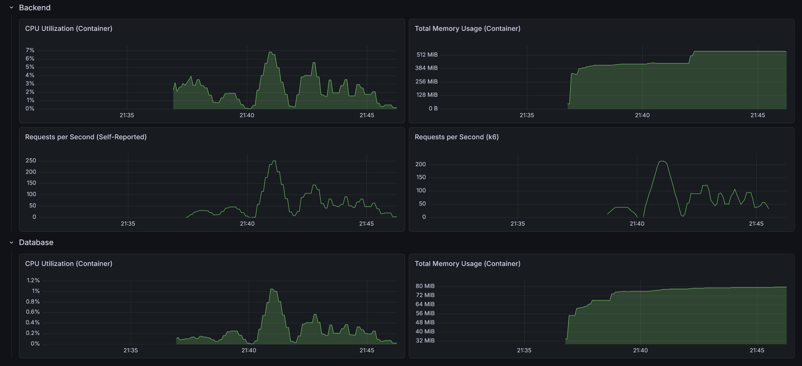

# RealWorld Backend: Java Spring Boot ("Hive" - Vertical Hexagonal)

This is an implementation of the [RealWorld API](https://docs.realworld.show/specs/backend-specs/introduction/) using Java, Spring Boot, and **Hive Architecture**. Hive (Vertical Hexagonal) merges the strict isolation of Hexagonal Architecture with the high cohesion of Vertical Slice Architecture.

## Architecture

This implementation organizes the codebase into self-contained **Cells** (Feature Packages) that encapsulate their own Hexagonal layers.

### The Hive Principles
- **Feature-Isolated Cells**: The top-level package organization is by business feature (e.g., `user`, `article`). Each cell is a self-contained "Hexagon" responsible for its own business logic, API endpoints, and persistence.
- **Internal Hexagon**: Within each cell, code is structured into `domain`, `application`, and `infrastructure` layers, maintaining the dependency rule: Inwards towards the Domain.
- **Port-Based Communication (Internal APIs)**: Cells are forbidden from touching each other's internal ports or adapters. Cross-cell interaction MUST happen only through specialized **Internal API Ports** (located in `application.port.api`).
- **Persistence Decoupling**: Cells do not share JPA entities or repositories. Relationships between cells (e.g., Article to Author) are managed using **IDs** and resolved through the Internal APIs, ensuring database-level isolation.
- **Shared Core**: Cross-cutting concerns like security (JWT), global exception handling, and shared configurations reside in a central `core` package.

## Tech Stack

- **Java 25**
- **Spring Boot 4.0.5**
- **Spring Data JPA**
- **H2 / PostgreSQL** (depending on configuration)
- **Maven**
- **MapStruct**: For type-safe mapping between layers
- **Monitoring**: Spring Boot Actuator with Micrometer & Prometheus integration
- **Security**: Stateless JWT Authentication

## Directory Structure

```text
src/main/java/com/sakrafux/realworld/
├── article/                # --- ARTICLE CELL ---
│   ├── domain/             # Models (Article, Comment, Author)
│   ├── application/        # Orchestration logic
│   │   ├── port/in         # Driving Ports (Use Cases)
│   │   ├── port/out        # Driven Ports (Repositories)
│   │   ├── port/api        # Internal Ports for other cells
│   │   └── service/        # Use Case implementations
│   └── infrastructure/     # Technical details
│       ├── web/            # REST Controllers and DTOs
│       └── persistence/    # JPA Entities (ID-based links) and Repositories
│
├── user/                   # --- USER CELL ---
│   ├── domain/             # Models (User, Profile)
│   ├── application/ 
│   │   ├── port/in         
│   │   ├── port/out        
│   │   ├── port/api 
│   │   └── service/        
│   └── infrastructure/     
│       ├── web/            
│       └── persistence/    
│
├── core/                   # --- SHARED CORE ---
│   ├── configuration/      # Global Spring Setup
│   ├── exception/          # Global Exception Handling
│   ├── security/           # JWT & Auth Filters
│   └── persistence/        # BaseEntity & Shared JPA logic
│
└── RealworldApplication.java
```

## Performance

- Max CPU Utilization: 6.88%
- Max Memory Usage: 550 MiB
- Max Requests per Second: 251 / 215



### API test suite

- On startup: 3.04s
- After 10 warm-up runs: 1.46s
- After load test: 1.15s

### Load test suite

#### Light load (10 VUs / 30s)

    HTTP
    http_req_duration..............: avg=9.27ms  min=1.39ms  med=6.39ms  max=129.84ms p(90)=13.08ms p(95)=20.56ms
      { expected_response:true }...: avg=9.27ms  min=1.39ms  med=6.39ms  max=129.84ms p(90)=13.08ms p(95)=20.56ms
      { name:AddComment }..........: avg=9.19ms  min=5.26ms  med=7.74ms  max=34.01ms  p(90)=13.53ms p(95)=19.25ms
      { name:CreateArticle }.......: avg=13.64ms min=6.5ms   med=9.19ms  max=129.84ms p(90)=13.93ms p(95)=21.61ms
      { name:DeleteArticle }.......: avg=7.39ms  min=4ms     med=6.54ms  max=22.51ms  p(90)=11.72ms p(95)=13.11ms
      { name:DeleteComment }.......: avg=7ms     min=3.63ms  med=5.89ms  max=18.38ms  p(90)=10.59ms p(95)=12.51ms
      { name:FavoriteArticle }.....: avg=9.46ms  min=5.28ms  med=7.98ms  max=36.45ms  p(90)=13.23ms p(95)=18.53ms
      { name:FollowUser }..........: avg=6.43ms  min=3.63ms  med=5.7ms   max=25.32ms  p(90)=8.9ms   p(95)=11.91ms
      { name:GetArticle }..........: avg=4.4ms   min=2.44ms  med=3.64ms  max=22.78ms  p(90)=6.4ms   p(95)=8.35ms 
      { name:GetArticlesFeed }.....: avg=4.69ms  min=2.57ms  med=3.92ms  max=15.73ms  p(90)=7.13ms  p(95)=8.77ms 
      { name:GetComments }.........: avg=5.3ms   min=2.72ms  med=4.37ms  max=17.88ms  p(90)=7.75ms  p(95)=10.38ms
      { name:GetCurrentUser }......: avg=3.04ms  min=2.06ms  med=2.7ms   max=5.81ms   p(90)=4.12ms  p(95)=4.93ms 
      { name:GetGlobalArticles }...: avg=13.3ms  min=6.69ms  med=11.7ms  max=47.94ms  p(90)=18.59ms p(95)=23.06ms
      { name:GetProfile }..........: avg=3.96ms  min=1.59ms  med=3.35ms  max=24.77ms  p(90)=5.55ms  p(95)=6.66ms 
      { name:GetTags }.............: avg=2.98ms  min=1.39ms  med=2.49ms  max=9.88ms   p(90)=4.64ms  p(95)=6.95ms 
      { name:Login }...............: avg=69.59ms min=62.41ms med=66.58ms max=113.87ms p(90)=80.15ms p(95)=92.05ms
      { name:Register }............: avg=70.55ms min=63.38ms med=68.6ms  max=108.38ms p(90)=75.81ms p(95)=77.84ms
      { name:UnfavoriteArticle }...: avg=9.29ms  min=5.12ms  med=7.81ms  max=26.07ms  p(90)=15.4ms  p(95)=18.3ms 
      { name:UnfollowUser }........: avg=6.04ms  min=3.75ms  med=5.33ms  max=44.58ms  p(90)=7.62ms  p(95)=8.93ms 
    http_req_failed................: 0.00%  0 out of 2316
    http_reqs......................: 2316   72.878177/s

    EXECUTION
    iteration_duration.............: avg=1.07s   min=1s      med=1.06s   max=1.29s    p(90)=1.12s   p(95)=1.14s  
    iterations.....................: 283    8.905235/s
    vus............................: 5      min=5         max=10
    vus_max........................: 10     min=10        max=10

    NETWORK
    data_received..................: 1.8 MB 57 kB/s
    data_sent......................: 633 kB 20 kB/s

#### Medium load (50 VUs / 1m)

    HTTP
    http_req_duration..............: avg=73.44ms  min=793.33µs med=6.39ms  max=15.81s   p(90)=30.02ms  p(95)=66.87ms 
      { expected_response:true }...: avg=73.5ms   min=793.33µs med=6.39ms  max=15.81s   p(90)=29.94ms  p(95)=66.84ms 
      { name:AddComment }..........: avg=15ms     min=3.3ms    med=7.48ms  max=312.19ms p(90)=23.84ms  p(95)=40.89ms 
      { name:CreateArticle }.......: avg=326.62ms min=4.64ms   med=9.31ms  max=15.52s   p(90)=31.27ms  p(95)=51.64ms 
      { name:DeleteArticle }.......: avg=9.99ms   min=2.36ms   med=6ms     max=96.78ms  p(90)=21.51ms  p(95)=29.63ms 
      { name:DeleteComment }.......: avg=9.75ms   min=2.11ms   med=5.61ms  max=129.87ms p(90)=18.38ms  p(95)=33.12ms 
      { name:FavoriteArticle }.....: avg=31.09ms  min=3.26ms   med=7.59ms  max=15.56s   p(90)=26.88ms  p(95)=41.05ms 
      { name:FollowUser }..........: avg=9.78ms   min=1.89ms   med=5ms     max=278.36ms p(90)=16.27ms  p(95)=24.36ms 
      { name:GetArticle }..........: avg=9.83ms   min=1.41ms   med=3.57ms  max=349.96ms p(90)=13.61ms  p(95)=24.55ms 
      { name:GetArticlesFeed }.....: avg=23ms     min=1.39ms   med=3.7ms   max=15.51s   p(90)=13.87ms  p(95)=20ms    
      { name:GetComments }.........: avg=8.76ms   min=1.63ms   med=4.2ms   max=167.81ms p(90)=15.1ms   p(95)=25.44ms 
      { name:GetCurrentUser }......: avg=7.13ms   min=1ms      med=2.37ms  max=204.01ms p(90)=10.23ms  p(95)=23.82ms 
      { name:GetGlobalArticles }...: avg=51.04ms  min=5.11ms   med=10.82ms max=15.53s   p(90)=36.38ms  p(95)=50.6ms  
      { name:GetProfile }..........: avg=183.35ms min=1.08ms   med=3.1ms   max=15.37s   p(90)=12.35ms  p(95)=19.52ms 
      { name:GetTags }.............: avg=4.8ms    min=793.33µs med=2.25ms  max=98.98ms  p(90)=9.94ms   p(95)=16.98ms 
      { name:Login }...............: avg=472.54ms min=61.48ms  med=74.22ms max=15.81s   p(90)=207.16ms p(95)=310.19ms
      { name:Register }............: avg=442.17ms min=62.44ms  med=74.41ms max=15.59s   p(90)=161.46ms p(95)=242.95ms
      { name:UnfavoriteArticle }...: avg=13.12ms  min=3.43ms   med=7.39ms  max=213.02ms p(90)=26.04ms  p(95)=39.71ms 
      { name:UnfollowUser }........: avg=35.43ms  min=1.68ms   med=4.83ms  max=15.51s   p(90)=15.91ms  p(95)=25.79ms 
    http_req_failed................: 0.12%  16 out of 12980
    http_reqs......................: 12980  210.13046/s

    EXECUTION
    iteration_duration.............: avg=1.46s    min=1s       med=1.06s   max=17.06s   p(90)=1.2s     p(95)=1.31s   
    iterations.....................: 2069   33.494601/s
    vus............................: 28     min=28          max=50
    vus_max........................: 50     min=50          max=50

    NETWORK
    data_received..................: 10 MB  166 kB/s
    data_sent......................: 3.5 MB 57 kB/s

#### Heavy load (200 VUs / 3m)

    HTTP
    http_req_duration..............: avg=2.26s  min=846.84µs med=324.56ms max=34.63s p(90)=1.05s    p(95)=27.75s  
      { expected_response:true }...: avg=2.26s  min=846.84µs med=324.54ms max=34.63s p(90)=1.05s    p(95)=27.76s  
      { name:AddComment }..........: avg=1.17s  min=4.36ms   med=324.87ms max=33.75s p(90)=728.33ms p(95)=1.18s   
      { name:CreateArticle }.......: avg=5.28s  min=4.29ms   med=431.62ms max=34.63s p(90)=29.95s   p(95)=32.36s  
      { name:DeleteArticle }.......: avg=1.26s  min=2.73ms   med=274.64ms max=33.77s p(90)=788.28ms p(95)=1.15s   
      { name:DeleteComment }.......: avg=1.29s  min=2.76ms   med=278.19ms max=33.77s p(90)=820.47ms p(95)=1.37s   
      { name:FavoriteArticle }.....: avg=1.59s  min=3.53ms   med=300.16ms max=34.13s p(90)=795.5ms  p(95)=2.18s   
      { name:FollowUser }..........: avg=1.16s  min=1.58ms   med=295.73ms max=33.64s p(90)=712.57ms p(95)=989.51ms
      { name:GetArticle }..........: avg=1.18s  min=1.2ms    med=299.85ms max=33.84s p(90)=791.1ms  p(95)=1.06s   
      { name:GetArticlesFeed }.....: avg=1.52s  min=1.16ms   med=292.51ms max=33.81s p(90)=766.8ms  p(95)=1.32s   
      { name:GetComments }.........: avg=1.04s  min=1.62ms   med=261.47ms max=33.8s  p(90)=711.77ms p(95)=1s      
      { name:GetCurrentUser }......: avg=1.17s  min=965.31µs med=294.3ms  max=34.11s p(90)=810.09ms p(95)=1.02s   
      { name:GetGlobalArticles }...: avg=1.4s   min=7ms      med=289.5ms  max=33.75s p(90)=752.74ms p(95)=1.25s   
      { name:GetProfile }..........: avg=4.56s  min=1.07ms   med=345.67ms max=34.13s p(90)=27.81s   p(95)=32.05s  
      { name:GetTags }.............: avg=1.41s  min=846.84µs med=263.05ms max=34.01s p(90)=786.92ms p(95)=1.25s   
      { name:Login }...............: avg=6.09s  min=74.47ms  med=621.43ms max=34.52s p(90)=30.25s   p(95)=32.5s   
      { name:Register }............: avg=5.74s  min=64.21ms  med=588.72ms max=34.37s p(90)=30.32s   p(95)=32.42s  
      { name:UnfavoriteArticle }...: avg=1.14s  min=3.35ms   med=282.37ms max=33.79s p(90)=794.18ms p(95)=1.04s   
      { name:UnfollowUser }........: avg=1.53s  min=2.45ms   med=292.29ms max=33.65s p(90)=742.34ms p(95)=1.21s   
    http_req_failed................: 0.17%  27 out of 15220
    http_reqs......................: 15220  79.846091/s

    EXECUTION
    iteration_duration.............: avg=11.07s min=1s       med=2.82s    max=1m10s  p(90)=34.1s    p(95)=35.61s  
    iterations.....................: 3421   17.947009/s
    vus............................: 134    min=134         max=200
    vus_max........................: 200    min=200         max=200

    NETWORK
    data_received..................: 12 MB  64 kB/s
    data_sent......................: 4.1 MB 22 kB/s