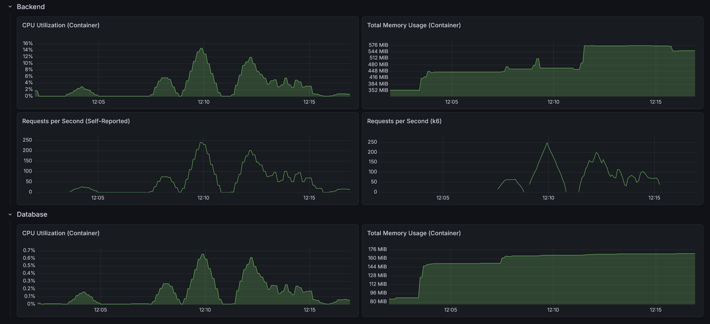

# RealWorld Backend: Java Spring Boot (Layered Architecture)

This is an implementation of the [RealWorld API](https://docs.realworld.show/specs/backend-specs/introduction/) using Java and Spring Boot.

## Architecture

This implementation follows a classic **Layered Architecture** (also known as N-Tier Architecture):

- **Web/Controller Layer**: Handles incoming HTTP requests and maps them to service calls.
- **Service Layer**: Contains the business logic and orchestrates data flow.
- **Persistence/Repository Layer**: Manages data access and interaction with the database.
- **Domain Layer**: Defines the core entities and data models.

## Tech Stack

- **Java 25**
- **Spring Boot 4.0.5**
- **Spring Data JPA**
- **H2 / PostgreSQL** (depending on configuration)
- **Maven**
- **Monitoring**: Spring Boot Actuator with Micrometer & Prometheus integration
- **Security**: Stateless JWT Authentication

## Directory Structure

```text
src/
├── main/
│   ├── java/
│   │   └── com.sakrafux.realworld/
│   │       ├── configuration/   # Spring configuration (Security, JPA, Filters)
│   │       ├── controller/      # REST API endpoints and Global Exception Handler
│   │       ├── dto/             # Data Transfer Objects (Request/Response)
│   │       ├── entity/          # JPA Database Entities
│   │       ├── exception/       # Custom exceptions 
│   │       ├── mapper/          # MapStruct mappers (DTO <-> Entity)
│   │       ├── repository/      # Spring Data JPA Repositories
│   │       ├── security/        # JWT parsing and authentication filters
│   │       └── service/         # Core business logic
│   └── resources/               # application.yml
└── test/
    ├── java/
    │   └── com.sakrafux.realworld/
    │       ├── controller/      # Integration tests for REST endpoints (*IT.java)
    │       ├── security/        # Unit tests for security utilities (*Test.java)
    │       └── service/         # Unit tests for business logic (*Test.java)
    └── resources/               # application.yml for testing (in-memory H2)
```

## Performance



### API test suite

- On startup: 3.34s
- After 10 warm-up runs: 1.23s
- After load test: 1.06s

### Load test suite

#### Light load (10 VUs / 30s)

    HTTP
    http_req_duration..............: avg=21.7ms  min=1.19ms  med=6.48ms  max=440.11ms p(90)=66.7ms   p(95)=81.17ms 
      { expected_response:true }...: avg=21.7ms  min=1.19ms  med=6.48ms  max=440.11ms p(90)=66.7ms   p(95)=81.17ms 
      { name:AddComment }..........: avg=8.94ms  min=3.86ms  med=6.93ms  max=25.51ms  p(90)=15.53ms  p(95)=18.8ms  
      { name:CreateArticle }.......: avg=10.7ms  min=4.68ms  med=7.85ms  max=39.06ms  p(90)=19.7ms   p(95)=24.13ms 
      { name:DeleteArticle }.......: avg=7.4ms   min=3.36ms  med=5.31ms  max=25.4ms   p(90)=14.08ms  p(95)=16.61ms 
      { name:DeleteComment }.......: avg=7.34ms  min=3.21ms  med=5.09ms  max=35.62ms  p(90)=14.49ms  p(95)=17.37ms 
      { name:FavoriteArticle }.....: avg=8.93ms  min=4.16ms  med=6.31ms  max=34.96ms  p(90)=16.59ms  p(95)=22.12ms 
      { name:FollowUser }..........: avg=6.4ms   min=3.05ms  med=5.17ms  max=23.09ms  p(90)=10.44ms  p(95)=12.93ms 
      { name:GetArticle }..........: avg=5.21ms  min=2.03ms  med=3.43ms  max=44.73ms  p(90)=10.25ms  p(95)=13.38ms 
      { name:GetArticlesFeed }.....: avg=4.12ms  min=1.65ms  med=2.79ms  max=30.81ms  p(90)=7.69ms   p(95)=10.84ms 
      { name:GetComments }.........: avg=5.54ms  min=1.97ms  med=3.76ms  max=35.02ms  p(90)=11.45ms  p(95)=14.18ms 
      { name:GetCurrentUser }......: avg=3.58ms  min=1.34ms  med=2.43ms  max=18.75ms  p(90)=6.86ms   p(95)=9.68ms  
      { name:GetGlobalArticles }...: avg=13.66ms min=5.45ms  med=9.42ms  max=56.27ms  p(90)=26.08ms  p(95)=35.55ms 
      { name:GetTags }.............: avg=3.24ms  min=1.19ms  med=2.13ms  max=15.86ms  p(90)=6.45ms   p(95)=9.77ms  
      { name:Login }...............: avg=87.39ms min=60.65ms med=66.32ms max=399.01ms p(90)=148.48ms p(95)=182.44ms
      { name:Register }............: avg=90.51ms min=62.27ms med=69.37ms max=440.11ms p(90)=153.72ms p(95)=188.5ms 
      { name:UnfavoriteArticle }...: avg=9.12ms  min=4.2ms   med=6.51ms  max=38.06ms  p(90)=16.78ms  p(95)=21.02ms 
      { name:UnfollowUser }........: avg=6.32ms  min=3.03ms  med=4.87ms  max=28.28ms  p(90)=10.75ms  p(95)=12.91ms 
    http_req_failed................: 0.00%  0 out of 3791
    http_reqs......................: 3791   121.699224/s

    EXECUTION
    iteration_duration.............: avg=1.37s   min=1.24s   med=1.28s   max=2.05s    p(90)=1.62s    p(95)=1.72s   
    iterations.....................: 223    7.158778/s
    vus............................: 2      min=2         max=10
    vus_max........................: 10     min=10        max=10

    NETWORK
    data_received..................: 2.8 MB 91 kB/s
    data_sent......................: 988 kB 32 kB/s

#### Medium load (50 VUs / 1m)

    HTTP
    http_req_duration..............: avg=147.73ms min=651.13µs med=88.41ms  max=1.94s    p(90)=378.46ms p(95)=521.04ms
      { expected_response:true }...: avg=147.73ms min=651.13µs med=88.41ms  max=1.94s    p(90)=378.46ms p(95)=521.04ms
      { name:AddComment }..........: avg=118.17ms min=2.53ms   med=80.95ms  max=1.06s    p(90)=280.68ms p(95)=386.95ms
      { name:CreateArticle }.......: avg=172.68ms min=3.19ms   med=117.78ms max=1.06s    p(90)=411.34ms p(95)=531.3ms 
      { name:DeleteArticle }.......: avg=82.75ms  min=2ms      med=55.35ms  max=619.96ms p(90)=203.52ms p(95)=260.02ms
      { name:DeleteComment }.......: avg=83.32ms  min=1.97ms   med=59.22ms  max=755.84ms p(90)=194.64ms p(95)=268.81ms
      { name:FavoriteArticle }.....: avg=89.08ms  min=2.88ms   med=59.45ms  max=1.08s    p(90)=186.52ms p(95)=254.77ms
      { name:FollowUser }..........: avg=72.12ms  min=1.83ms   med=17.64ms  max=987.78ms p(90)=196.4ms  p(95)=274.12ms
      { name:GetArticle }..........: avg=117.24ms min=1.24ms   med=65.4ms   max=1.09s    p(90)=322.4ms  p(95)=433.56ms
      { name:GetArticlesFeed }.....: avg=88.2ms   min=865.74µs med=46.39ms  max=756.47ms p(90)=236.06ms p(95)=298.15ms
      { name:GetComments }.........: avg=88.49ms  min=1.18ms   med=60.61ms  max=912.15ms p(90)=217.76ms p(95)=286.19ms
      { name:GetCurrentUser }......: avg=172.99ms min=745.93µs med=92.9ms   max=1.2s     p(90)=466.39ms p(95)=632.2ms 
      { name:GetGlobalArticles }...: avg=104.47ms min=4.09ms   med=79.56ms  max=611.06ms p(90)=236.61ms p(95)=288.24ms
      { name:GetTags }.............: avg=79.28ms  min=651.13µs med=45.87ms  max=769.49ms p(90)=227.25ms p(95)=281.73ms
      { name:Login }...............: avg=384.49ms min=60.23ms  med=303.93ms max=1.58s    p(90)=753.4ms  p(95)=890.86ms
      { name:Register }............: avg=352.25ms min=61.48ms  med=298.31ms max=1.94s    p(90)=604.88ms p(95)=794.82ms
      { name:UnfavoriteArticle }...: avg=85.13ms  min=2.48ms   med=59.9ms   max=904.3ms  p(90)=197.55ms p(95)=257.55ms
      { name:UnfollowUser }........: avg=68.53ms  min=1.82ms   med=20.93ms  max=1.3s     p(90)=181.03ms p(95)=242.36ms
    http_req_failed................: 0.00%  0 out of 14688
    http_reqs......................: 14688  239.953606/s

    EXECUTION
    iteration_duration.............: avg=3.51s    min=1.24s    med=3.57s    max=5.01s    p(90)=4.26s    p(95)=4.54s   
    iterations.....................: 864    14.114918/s
    vus............................: 13     min=13         max=50
    vus_max........................: 50     min=50         max=50

    NETWORK
    data_received..................: 11 MB  177 kB/s
    data_sent......................: 3.8 MB 63 kB/s

#### Heavy load (200 VUs / 3m)

    HTTP
    http_req_duration..............: avg=1.69s  min=700.63µs med=619.98ms max=29.22s p(90)=1.8s   p(95)=10.78s
      { expected_response:true }...: avg=1.69s  min=700.63µs med=619.98ms max=29.22s p(90)=1.8s   p(95)=10.78s
      { name:AddComment }..........: avg=1.6s   min=2.36ms   med=588.63ms max=28s    p(90)=1.56s  p(95)=4.73s 
      { name:CreateArticle }.......: avg=1.59s  min=3.04ms   med=652.77ms max=29.21s p(90)=1.87s  p(95)=2.86s 
      { name:DeleteArticle }.......: avg=1.61s  min=1.96ms   med=565.1ms  max=27.74s p(90)=1.48s  p(95)=11s   
      { name:DeleteComment }.......: avg=1.51s  min=1.92ms   med=538.38ms max=27.37s p(90)=1.46s  p(95)=10.77s
      { name:FavoriteArticle }.....: avg=1.67s  min=2.63ms   med=575.09ms max=29.22s p(90)=1.47s  p(95)=10.85s
      { name:FollowUser }..........: avg=1.42s  min=1.84ms   med=573.6ms  max=27.35s p(90)=1.41s  p(95)=2.08s 
      { name:GetArticle }..........: avg=1.41s  min=1.11ms   med=585.14ms max=27.58s p(90)=1.51s  p(95)=2.64s 
      { name:GetArticlesFeed }.....: avg=1.35s  min=905.74µs med=558.46ms max=27.9s  p(90)=1.44s  p(95)=2.16s 
      { name:GetComments }.........: avg=1.42s  min=1.16ms   med=559.9ms  max=27.75s p(90)=1.4s   p(95)=2.12s 
      { name:GetCurrentUser }......: avg=1.56s  min=755.73µs med=635.26ms max=27.87s p(90)=1.95s  p(95)=3.82s 
      { name:GetGlobalArticles }...: avg=1.71s  min=5.54ms   med=602.36ms max=28.61s p(90)=1.71s  p(95)=11.04s
      { name:GetTags }.............: avg=1.52s  min=700.63µs med=546.17ms max=28.1s  p(90)=1.49s  p(95)=2.91s 
      { name:Login }...............: avg=1.83s  min=64.48ms  med=827.67ms max=27.91s p(90)=2.36s  p(95)=4.87s 
      { name:Register }............: avg=2.73s  min=67.68ms  med=882.07ms max=28.11s p(90)=5.17s  p(95)=18.53s
      { name:UnfavoriteArticle }...: avg=1.36s  min=2.3ms    med=542.3ms  max=28.12s p(90)=1.32s  p(95)=2.02s 
      { name:UnfollowUser }........: avg=1.65s  min=1.74ms   med=594.49ms max=27.9s  p(90)=1.6s   p(95)=2.85s 
    http_req_failed................: 0.00%  0 out of 22389
    http_reqs......................: 22389  109.870413/s

    EXECUTION
    iteration_duration.............: avg=29.74s min=4.63s    med=25.92s   max=1m8s   p(90)=55.79s p(95)=1m3s  
    iterations.....................: 1317   6.462965/s
    vus............................: 73     min=73         max=200
    vus_max........................: 200    min=200        max=200

    NETWORK
    data_received..................: 16 MB  80 kB/s
    data_sent......................: 5.8 MB 29 kB/s
