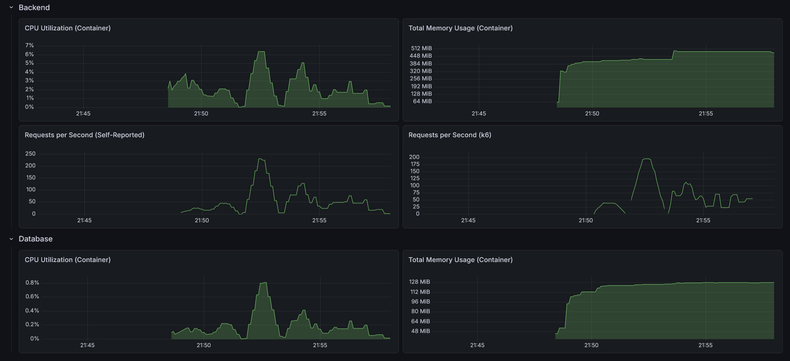

# RealWorld Backend: Java Spring Boot (Vertical Slice Architecture)

This is an implementation of the [RealWorld API](https://docs.realworld.show/specs/backend-specs/introduction/) using Java and Spring Boot.

## Architecture

This implementation follows a **Vertical Slice Architecture** (Package-by-Feature):

- **Feature-Centric**: Each package (e.g., `article`, `user`, `comment`) contains all the components required for that specific feature, including Controllers, Services, Repositories, Entities, and DTOs.
- **High Cohesion**: Business logic, data access, and API definitions for a single domain are kept together, making features easier to find and modify in isolation.
- **Internal Simplicity**: Because the slices are extremely granular (one slice per domain concept), there is **no internal sub-layering**. Controllers, services, and repositories live side-by-side in the same package for maximum visibility and minimum boilerplate.
- **Cross-Cutting Concerns**: Infrastructure and shared utilities (Security, Global Exceptions, Configurations, Base Entities) reside in specialized `core` or `security` packages.

## Tech Stack

- **Java 25**
- **Spring Boot 4.0.5**
- **Spring Data JPA**
- **H2 / PostgreSQL** (depending on configuration)
- **Maven**
- **Monitoring**: Spring Boot Actuator with Micrometer & Prometheus integration
- **Security**: Stateless JWT Authentication

## Directory Structure (Current: Granular Slices)

In this approach, slices are kept as small as possible to minimize complexity within a single package.

```text
src/
└── main/
    ├── java/
    │   └── com.sakrafux.realworld/
    │       ├── article/      # All article-related code (no sub-packages)
    │       ├── comment/      # All comment-related code
    │       ├── profile/      # All profile-related code
    │       ├── tag/          # All tag-related code
    │       ├── user/         # All user-related code
    │       ├── core/         # Shared infrastructure
    │       └── security/     # Auth logic
    └── resources/            # application.yml
```

## Alternative Approach: Feature-Based Layering

For larger projects, vertical slices can be grouped into broader business domains. In this scenario, each domain slice would internally follow a **Layered Architecture** to maintain order as the number of classes grows.

```text
src/
└── main/
    ├── java/
    │   └── com.sakrafux.realworld/
    │       ├── article/              # --- ARTICLE DOMAIN ---
    │       │   ├── controller/       # Controllers & DTOs for Article, Comment, Tag
    │       │   ├── service/          # Business logic
    │       │   ├── repository/       # Repositories
    │       │   └── entity/           # JPA Entities
    │       │
    │       ├── user/                 # --- USER DOMAIN ---
    │       │   ├── controller/       # Controllers & DTOs for User & Profile
    │       │   ├── service/          
    │       │   ├── repository/       
    │       │   └── entity/           
    │       │
    │       ├── core/                 # Shared logic
    │       └── security/             
    └── resources/            
```

## Testing

This project prioritizes the global **API Test Suite** (located in the root `/test/api` directory) as the primary verification tool for specification compliance. 

Individual Unit and Integration tests within this module are largely derivative of the logic found in the [Layered Architecture](../java-springboot-layered) implementation. For this reason, and due to the heavy reliance on the end-to-end API suite, additional module-specific tests are kept minimal to avoid redundancy while ensuring business rules are verified within their respective feature packages.

## Performance

- Max CPU Utilization: 6.39%
- Max Memory Usage: 496 MiB
- Max Requests per Second: 232 / 197



### API test suite

- On startup: 3.3s
- After 10 warm-up runs: 1.38s
- After load test: 1.06s

### Load test suite

#### Light load (10 VUs / 30s)

    HTTP
    http_req_duration..............: avg=8.89ms  min=1.41ms  med=5.9ms   max=233.01ms p(90)=12.5ms  p(95)=19.17ms 
      { expected_response:true }...: avg=8.89ms  min=1.41ms  med=5.9ms   max=233.01ms p(90)=12.46ms p(95)=19.18ms 
      { name:AddComment }..........: avg=8.88ms  min=5.02ms  med=7.02ms  max=46.56ms  p(90)=12.13ms p(95)=15.75ms 
      { name:CreateArticle }.......: avg=12.16ms min=6.65ms  med=8.88ms  max=149.53ms p(90)=13.83ms p(95)=16.92ms 
      { name:DeleteArticle }.......: avg=7.13ms  min=4.07ms  med=5.64ms  max=25.13ms  p(90)=11.81ms p(95)=14.11ms 
      { name:DeleteComment }.......: avg=6.64ms  min=4.21ms  med=5.51ms  max=24.61ms  p(90)=10.46ms p(95)=11.94ms 
      { name:FavoriteArticle }.....: avg=8.5ms   min=5.27ms  med=6.94ms  max=33.49ms  p(90)=12.57ms p(95)=16.68ms 
      { name:FollowUser }..........: avg=6.41ms  min=3.68ms  med=5.39ms  max=30.85ms  p(90)=8.62ms  p(95)=11.07ms 
      { name:GetArticle }..........: avg=4.5ms   min=2.24ms  med=3.8ms   max=29.16ms  p(90)=6.05ms  p(95)=7.71ms  
      { name:GetArticlesFeed }.....: avg=3.8ms   min=2.22ms  med=3.07ms  max=22.17ms  p(90)=5.53ms  p(95)=7.89ms  
      { name:GetComments }.........: avg=5.12ms  min=2.74ms  med=3.95ms  max=25.72ms  p(90)=7.87ms  p(95)=10.33ms 
      { name:GetCurrentUser }......: avg=3.71ms  min=2.16ms  med=2.62ms  max=11.83ms  p(90)=6.26ms  p(95)=9.16ms  
      { name:GetGlobalArticles }...: avg=12.61ms min=7.78ms  med=9.76ms  max=83.54ms  p(90)=18.33ms p(95)=23.01ms 
      { name:GetProfile }..........: avg=3.84ms  min=2ms     med=3.26ms  max=11.12ms  p(90)=5.97ms  p(95)=7.55ms  
      { name:GetTags }.............: avg=3.05ms  min=1.41ms  med=2.38ms  max=23.21ms  p(90)=5.01ms  p(95)=5.75ms  
      { name:Login }...............: avg=70.1ms  min=62.57ms med=64.35ms max=167.89ms p(90)=76.32ms p(95)=82.88ms 
      { name:Register }............: avg=76.18ms min=65ms    med=67.45ms max=233.01ms p(90)=87.99ms p(95)=100.65ms
      { name:UnfavoriteArticle }...: avg=8.43ms  min=5.26ms  med=7.07ms  max=24.46ms  p(90)=13.23ms p(95)=14.93ms 
      { name:UnfollowUser }........: avg=6.01ms  min=3.67ms  med=5.23ms  max=17.32ms  p(90)=8.75ms  p(95)=11.23ms 
    http_req_failed................: 0.08%  2 out of 2345
    http_reqs......................: 2345   73.927401/s

    EXECUTION
    iteration_duration.............: avg=1.07s   min=1s      med=1.06s   max=1.35s    p(90)=1.1s    p(95)=1.14s   
    iterations.....................: 285    8.98478/s
    vus............................: 8      min=8         max=10
    vus_max........................: 10     min=10        max=10

    NETWORK
    data_received..................: 1.9 MB 58 kB/s
    data_sent......................: 640 kB 20 kB/s

#### Medium load (50 VUs / 1m)

    HTTP
    http_req_duration..............: avg=123.5ms  min=813.35µs med=6.13ms  max=25.07s   p(90)=36.64ms  p(95)=72.44ms 
      { expected_response:true }...: avg=123.68ms min=813.35µs med=6.12ms  max=25.07s   p(90)=36.49ms  p(95)=72.26ms 
      { name:AddComment }..........: avg=18.47ms  min=3.11ms   med=7.01ms  max=334.56ms p(90)=32.25ms  p(95)=71.16ms 
      { name:CreateArticle }.......: avg=678.66ms min=4.25ms   med=8.71ms  max=25.07s   p(90)=44.82ms  p(95)=833.81ms
      { name:DeleteArticle }.......: avg=10.71ms  min=2.54ms   med=5.82ms  max=167.09ms p(90)=23.6ms   p(95)=33.27ms 
      { name:DeleteComment }.......: avg=11.1ms   min=2.49ms   med=5.57ms  max=161.84ms p(90)=23.28ms  p(95)=34.58ms 
      { name:FavoriteArticle }.....: avg=14.73ms  min=3.16ms   med=7.23ms  max=343.78ms p(90)=31.32ms  p(95)=50.03ms 
      { name:FollowUser }..........: avg=12.72ms  min=1.86ms   med=4.99ms  max=296.5ms  p(90)=18.92ms  p(95)=33.39ms 
      { name:GetArticle }..........: avg=12.09ms  min=1.35ms   med=3.86ms  max=367.19ms p(90)=20.79ms  p(95)=50.31ms 
      { name:GetArticlesFeed }.....: avg=35.33ms  min=1.09ms   med=3.05ms  max=25.07s   p(90)=13.09ms  p(95)=20.26ms 
      { name:GetComments }.........: avg=11.24ms  min=1.53ms   med=3.82ms  max=286.15ms p(90)=20.13ms  p(95)=47.97ms 
      { name:GetCurrentUser }......: avg=9.31ms   min=949.65µs med=2.38ms  max=221.81ms p(90)=12.61ms  p(95)=39.94ms 
      { name:GetGlobalArticles }...: avg=16.44ms  min=4.67ms   med=10.06ms max=144.86ms p(90)=34.86ms  p(95)=50.71ms 
      { name:GetProfile }..........: avg=335.6ms  min=1.09ms   med=2.99ms  max=24.97s   p(90)=11.55ms  p(95)=20.13ms 
      { name:GetTags }.............: avg=5.5ms    min=813.35µs med=2.47ms  max=107.58ms p(90)=11.64ms  p(95)=17.26ms 
      { name:Login }...............: avg=794.35ms min=60.85ms  med=75.23ms max=24.98s   p(90)=243.91ms p(95)=1.06s   
      { name:Register }............: avg=726.99ms min=63.41ms  med=71.1ms  max=24.78s   p(90)=147.31ms p(95)=375.61ms
      { name:UnfavoriteArticle }...: avg=13.7ms   min=3.15ms   med=7.05ms  max=211.35ms p(90)=28.03ms  p(95)=45.24ms 
      { name:UnfollowUser }........: avg=10.19ms  min=2ms      med=4.95ms  max=182.38ms p(90)=13.64ms  p(95)=23.73ms 
    http_req_failed................: 0.20%  24 out of 11925
    http_reqs......................: 11925  174.507771/s

    EXECUTION
    iteration_duration.............: avg=1.77s    min=1s       med=1.06s   max=26.49s   p(90)=1.25s    p(95)=2.1s    
    iterations.....................: 1896   27.745638/s
    vus............................: 46     min=46          max=50
    vus_max........................: 50     min=50          max=50

    NETWORK
    data_received..................: 9.4 MB 138 kB/s
    data_sent......................: 3.2 MB 47 kB/s

#### Heavy load (200 VUs / 3m)

    HTTP
    http_req_duration..............: avg=2.78s  min=765.64µs med=327.26ms max=39.09s p(90)=1.01s    p(95)=34.89s  
      { expected_response:true }...: avg=2.71s  min=765.64µs med=326.64ms max=39.09s p(90)=995.46ms p(95)=34.86s  
      { name:AddComment }..........: avg=1.54s  min=2.89ms   med=309.37ms max=35.78s p(90)=808.61ms p(95)=1.05s   
      { name:CreateArticle }.......: avg=6.35s  min=3.47ms   med=414.6ms  max=38.63s p(90)=34.92s   p(95)=35.67s  
      { name:DeleteArticle }.......: avg=1.58s  min=2.41ms   med=276.39ms max=38.66s p(90)=794.37ms p(95)=1.16s   
      { name:DeleteComment }.......: avg=2.03s  min=2.74ms   med=278.67ms max=38.1s  p(90)=778.64ms p(95)=20.45s  
      { name:FavoriteArticle }.....: avg=1.44s  min=3.95ms   med=291.76ms max=38.04s p(90)=744.64ms p(95)=982.29ms
      { name:FollowUser }..........: avg=1.49s  min=1.37ms   med=300.28ms max=38.69s p(90)=803.52ms p(95)=1.12s   
      { name:GetArticle }..........: avg=1.71s  min=1.32ms   med=315.79ms max=38.66s p(90)=776.44ms p(95)=1.12s   
      { name:GetArticlesFeed }.....: avg=1.36s  min=1.04ms   med=272.84ms max=38.27s p(90)=773.97ms p(95)=973.31ms
      { name:GetComments }.........: avg=2.01s  min=1.31ms   med=261.74ms max=38.27s p(90)=817.87ms p(95)=20.44s  
      { name:GetCurrentUser }......: avg=1.6s   min=1.05ms   med=294.79ms max=39.08s p(90)=809.3ms  p(95)=1.15s   
      { name:GetGlobalArticles }...: avg=1.97s  min=7.4ms    med=299.92ms max=38.69s p(90)=817.08ms p(95)=16.68s  
      { name:GetProfile }..........: avg=5.35s  min=1.09ms   med=353.9ms  max=38.43s p(90)=34.82s   p(95)=35.6s   
      { name:GetTags }.............: avg=1.3s   min=765.64µs med=255.65ms max=39.09s p(90)=749.18ms p(95)=962.15ms
      { name:Login }...............: avg=7.47s  min=85.74ms  med=618.93ms max=39s    p(90)=35.45s   p(95)=35.84s  
      { name:Register }............: avg=7.03s  min=62.96ms  med=567.53ms max=38.33s p(90)=35.12s   p(95)=35.88s  
      { name:UnfavoriteArticle }...: avg=1.76s  min=3.14ms   med=286.89ms max=38.7s  p(90)=779.75ms p(95)=1.15s   
      { name:UnfollowUser }........: avg=1.72s  min=2.12ms   med=300.07ms max=38.66s p(90)=771.25ms p(95)=1.29s   
    http_req_failed................: 0.36%  48 out of 13226
    http_reqs......................: 13226  65.979204/s

    EXECUTION
    iteration_duration.............: avg=13.35s min=1s       med=2.78s    max=1m20s  p(90)=38.72s   p(95)=39.9s   
    iterations.....................: 2981   14.871012/s
    vus............................: 115    min=115         max=200
    vus_max........................: 200    min=200         max=200

    NETWORK
    data_received..................: 11 MB  52 kB/s
    data_sent......................: 3.6 MB 18 kB/s

