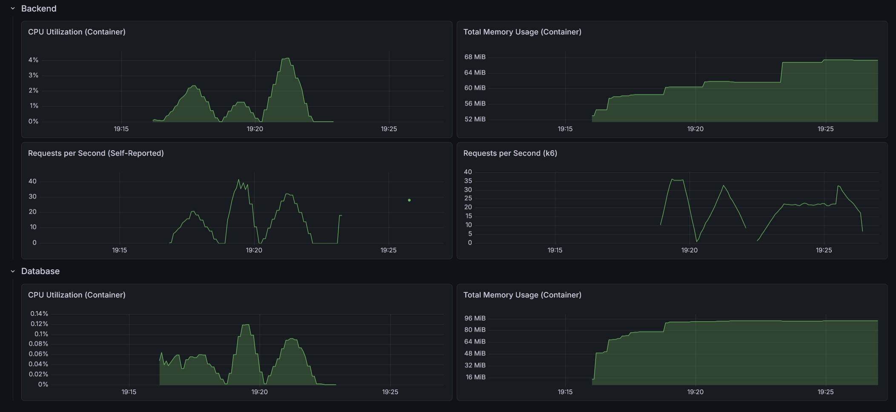

# RealWorld Backend: Python + FastAPI (Vertical Slice)

This is an implementation of the [RealWorld API](https://docs.realworld.show/specs/backend-specs/introduction/) using Python, FastAPI, and a **Vertical Slice Architecture**. Each feature is self-contained — owning its HTTP layer, business logic, data access, and models — maximizing cohesion while keeping cross-cutting concerns in a shared kernel.

## Architecture (Vertical Slices)

The architecture is organized by business capability, not by technical layer:

- **Shared (`app/shared`)**: Cross-cutting kernel. Provides configuration (`config`), async PostgreSQL connection pooling (`database`), error types (`errors`), password hashing and JWT (`security`), and HTTP middleware/auth helpers (`web`). Depends only on external libraries.
- **Features (`app/features`)**: Vertical slices. Each feature (`article`, `comment`, `user`) is a self-contained module with its own:
    - `controller.py` — FastAPI router and HTTP handlers
    - `service.py` — Business logic orchestration
    - `repository.py` — Async PostgreSQL data access (asyncpg)
    - `domain.py` — Domain models and entities
    - `dto.py` — Pydantic request/response schemas
    - *Independence*: Features only depend on `shared` — they never import from another feature's internals.

## Tech Stack

- **Python 3.13+**
- **FastAPI**: High-performance async web framework
- **Pydantic**: Data validation and serialization
- **asyncpg**: Native async PostgreSQL driver (no ORM)
- **bcrypt**: Secure password hashing
- **PyJWT**: JSON Web Token signing and verification
- **OpenTelemetry**: Observability, distributed tracing, and metrics
- **pytest** + **pytest-asyncio**: Unit and integration testing

## Directory Structure

```text
.
├── Dockerfile                    # Production build
├── requirements.txt              # Python dependencies
├── app/
│   ├── main.py                   # Entry point — FastAPI app creation & lifespan
│   ├── features/                 # --- VERTICAL SLICES ---
│   │   ├── article/              # Article & Tag management
│   │   │   ├── controller.py
│   │   │   ├── service.py
│   │   │   ├── repository.py
│   │   │   ├── domain.py
│   │   │   └── dto.py
│   │   ├── comment/              # Comment management
│   │   │   ├── controller.py
│   │   │   ├── service.py
│   │   │   ├── repository.py
│   │   │   ├── domain.py
│   │   │   └── dto.py
│   │   └── user/                 # User & Profile management
│   │       ├── controller.py
│   │       ├── service.py
│   │       ├── repository.py
│   │       ├── domain.py
│   │       └── dto.py
│   ├── shared/                   # --- SHARED KERNEL ---
│   │   ├── config/               # Environment configuration
│   │   ├── database/             # Async DB connection pool
│   │   ├── errors/               # AppError & error DTOs
│   │   ├── security/             # Password hashing & JWT
│   │   └── web/                  # Auth dependency & error handlers
│   └── tests/                    # Test suite
│       ├── conftest.py           # Shared fixtures (DB pool, test client)
│       ├── features/             # Unit tests per slice
│       └── integration/          # API integration tests
└── README.md
```

## Why this works for Python/FastAPI

1.  **Cohesion over Convention**: Each slice owns everything it needs. When you work on articles, you stay in one directory — no scattering across model/view/controller folders.
2.  **Implicit Namespace Packages**: No `__init__.py` files. Python 3.3+ implicit namespaces keep the tree clean and reduce boilerplate.
3.  **Async-native Stack**: FastAPI + asyncpg deliver high concurrency without thread pools or ORM overhead. Every database call is a native `await`.
4.  **Type Safety**: Pydantic models provide runtime validation and IDE autocompletion, catching schema mismatches at the boundary before they hit the database.
5.  **Testable by Design**: Each slice can be tested in isolation. The shared database pool is injected via dependency overrides, making integration tests fast and repeatable.

## Performance

(Data cutoff during heavy load test)

- Max CPU Utilization: 4.17%
- Max Memory Usage: 67.4 MiB
- Max Requests per Second: 42 / 36



### API test suite

- On startup: 4.20s
- After 10 warm-up runs: 4.42s
- After load test: 4.39s

### Load test suite 

#### Light load (10 VUs / 30s)

    HTTP
    http_req_duration..............: avg=30.59ms  min=1.17ms   med=6.25ms   max=478.76ms p(90)=152.42ms p(95)=193.45ms
      { expected_response:true }...: avg=29.72ms  min=1.17ms   med=6.24ms   max=478.76ms p(90)=151.07ms p(95)=190.7ms 
      { name:AddComment }..........: avg=9.62ms   min=4.99ms   med=9.51ms   max=14.59ms  p(90)=11.68ms  p(95)=13.46ms 
      { name:CreateArticle }.......: avg=185.35ms min=132.24ms med=164.84ms max=478.76ms p(90)=193.6ms  p(95)=373.72ms
      { name:DeleteArticle }.......: avg=7.66ms   min=4.53ms   med=7.14ms   max=18.04ms  p(90)=11.04ms  p(95)=11.78ms 
      { name:DeleteComment }.......: avg=8.14ms   min=4.77ms   med=8.16ms   max=14.58ms  p(90)=9.95ms   p(95)=10.4ms  
      { name:FavoriteArticle }.....: avg=9.09ms   min=4.42ms   med=8.47ms   max=28.62ms  p(90)=11.81ms  p(95)=12.56ms 
      { name:FollowUser }..........: avg=10.09ms  min=3.19ms   med=5.4ms    max=466.36ms p(90)=8.93ms   p(95)=10.98ms 
      { name:GetArticle }..........: avg=5.44ms   min=2.6ms    med=5.35ms   max=33.14ms  p(90)=6.29ms   p(95)=6.87ms  
      { name:GetArticlesFeed }.....: avg=3.26ms   min=1.34ms   med=3.16ms   max=7.13ms   p(90)=4.24ms   p(95)=4.81ms  
      { name:GetComments }.........: avg=6.21ms   min=2.44ms   med=5.99ms   max=10.77ms  p(90)=7.95ms   p(95)=8.53ms  
      { name:GetCurrentUser }......: avg=10.88ms  min=1.42ms   med=1.77ms   max=223.46ms p(90)=2.58ms   p(95)=5.62ms  
      { name:GetGlobalArticles }...: avg=4.88ms   min=2.48ms   med=4.5ms    max=28.4ms   p(90)=6.02ms   p(95)=6.73ms  
      { name:GetProfile }..........: avg=38.98ms  min=1.35ms   med=2.98ms   max=216.91ms p(90)=206.51ms p(95)=210.18ms
      { name:GetTags }.............: avg=3.03ms   min=1.17ms   med=2.7ms    max=16.03ms  p(90)=4.16ms   p(95)=5.05ms  
      { name:Login }...............: avg=219.71ms min=214.77ms med=219.57ms max=225.67ms p(90)=224.04ms p(95)=224.25ms
      { name:Register }............: avg=239ms    min=218.25ms med=225.92ms max=451.54ms p(90)=238.97ms p(95)=301.99ms
      { name:UnfavoriteArticle }...: avg=9.56ms   min=4.87ms   med=9.13ms   max=19.86ms  p(90)=12.14ms  p(95)=13.93ms 
      { name:UnfollowUser }........: avg=6.01ms   min=2.81ms   med=4.77ms   max=15.79ms  p(90)=11.98ms  p(95)=12.96ms 
    http_req_failed................: 0.19%  4 out of 2008
    http_reqs......................: 2008   60.071104/s

    EXECUTION
    iteration_duration.............: avg=1.24s    min=1s       med=1.22s    max=1.53s    p(90)=1.24s    p(95)=1.44s   
    iterations.....................: 247    7.389224/s
    vus............................: 6      min=0         max=10
    vus_max........................: 10     min=10        max=10

    NETWORK
    data_received..................: 1.1 MB 34 kB/s
    data_sent......................: 517 kB 16 kB/s

#### Medium load (50 VUs / 1m)

    HTTP
    http_req_duration..............: avg=1.24s    min=1.28ms   med=914.74ms max=7.37s p(90)=2.74s  p(95)=3.39s 
      { expected_response:true }...: avg=1.24s    min=1.28ms   med=914.74ms max=7.37s p(90)=2.74s  p(95)=3.39s 
      { name:AddComment }..........: avg=1.58s    min=17.69ms  med=1.58s    max=4.49s p(90)=3.11s  p(95)=3.39s 
      { name:CreateArticle }.......: avg=2.66s    min=185.14ms med=2.47s    max=7.37s p(90)=4.38s  p(95)=4.83s 
      { name:DeleteArticle }.......: avg=1.32s    min=10.22ms  med=1.12s    max=5.13s p(90)=2.78s  p(95)=3.19s 
      { name:DeleteComment }.......: avg=1.53s    min=11.02ms  med=1.33s    max=4.94s p(90)=3.03s  p(95)=3.6s  
      { name:FavoriteArticle }.....: avg=1.52s    min=17.22ms  med=1.36s    max=5.81s p(90)=2.84s  p(95)=3.13s 
      { name:FollowUser }..........: avg=1.59s    min=3.15ms   med=1.33s    max=7.2s  p(90)=3.35s  p(95)=3.99s 
      { name:GetArticle }..........: avg=602.97ms min=4.31ms   med=449.91ms max=4.47s p(90)=1.56s  p(95)=2.02s 
      { name:GetArticlesFeed }.....: avg=538.21ms min=1.28ms   med=238.34ms max=4.04s p(90)=1.57s  p(95)=2.08s 
      { name:GetComments }.........: avg=1.12s    min=12.75ms  med=901.8ms  max=3.56s p(90)=2.48s  p(95)=2.92s 
      { name:GetCurrentUser }......: avg=682.42ms min=4.11ms   med=453.83ms max=6.47s p(90)=1.45s  p(95)=1.85s 
      { name:GetGlobalArticles }...: avg=534.19ms min=3.14ms   med=250.41ms max=3.81s p(90)=1.28s  p(95)=2.02s 
      { name:GetProfile }..........: avg=1s       min=1.67ms   med=819.65ms max=4.46s p(90)=1.98s  p(95)=2.44s 
      { name:GetTags }.............: avg=563.96ms min=2.04ms   med=441.89ms max=5.38s p(90)=1.27s  p(95)=1.78s 
      { name:Login }...............: avg=1.12s    min=323.58ms med=1.02s    max=4.67s p(90)=1.91s  p(95)=2.26s 
      { name:Register }............: avg=2.04s    min=219ms    med=1.93s    max=5.55s p(90)=3.88s  p(95)=4.23s 
      { name:UnfavoriteArticle }...: avg=1.74s    min=13.33ms  med=1.77s    max=7.17s p(90)=3.12s  p(95)=3.59s 
      { name:UnfollowUser }........: avg=1.58s    min=2.85ms   med=1.36s    max=4.5s  p(90)=3.34s  p(95)=3.55s 
    http_req_failed................: 0.00%  0 out of 2068
    http_reqs......................: 2068   31.979891/s

    EXECUTION
    iteration_duration.............: avg=6.01s    min=1s       med=3.98s    max=29.7s p(90)=12.26s p(95)=15.83s
    iterations.....................: 514    7.94858/s
    vus............................: 37     min=0         max=50
    vus_max........................: 50     min=50        max=50

    NETWORK
    data_received..................: 1.1 MB 16 kB/s
    data_sent......................: 527 kB 8.1 kB/s

#### Heavy load (200 VUs / 3m)

    HTTP
    http_req_duration..............: avg=7.78s  min=1.55ms   med=5.18s    max=59.99s p(90)=18.87s p(95)=23.84s
      { expected_response:true }...: avg=7.77s  min=1.55ms   med=5.18s    max=57s    p(90)=18.86s p(95)=23.81s
      { name:AddComment }..........: avg=11.42s min=122.64ms med=9.96s    max=41.72s p(90)=22.78s p(95)=28.67s
      { name:CreateArticle }.......: avg=15.57s min=792ms    med=14.09s   max=57s    p(90)=26.87s p(95)=32.36s
      { name:DeleteArticle }.......: avg=6.74s  min=10.84ms  med=4.96s    max=40.7s  p(90)=15.51s p(95)=22.2s 
      { name:DeleteComment }.......: avg=8.42s  min=11.76ms  med=6.06s    max=33.35s p(90)=19.7s  p(95)=23.13s
      { name:FavoriteArticle }.....: avg=11.29s min=25.41ms  med=9.43s    max=43.42s p(90)=23.07s p(95)=28.67s
      { name:FollowUser }..........: avg=10.78s min=3.52ms   med=9.38s    max=44.94s p(90)=22.58s p(95)=28.44s
      { name:GetArticle }..........: avg=4.58s  min=3.78ms   med=4.25s    max=21.25s p(90)=10.58s p(95)=13.69s
      { name:GetArticlesFeed }.....: avg=3.82s  min=2.07ms   med=745.73ms max=27.31s p(90)=11.53s p(95)=15.63s
      { name:GetComments }.........: avg=7.43s  min=9.1ms    med=5.79s    max=32.11s p(90)=15.74s p(95)=20.38s
      { name:GetCurrentUser }......: avg=4.38s  min=3.95ms   med=2.22s    max=37.68s p(90)=11.24s p(95)=16.13s
      { name:GetGlobalArticles }...: avg=3.65s  min=3.48ms   med=664.59ms max=31.62s p(90)=10.52s p(95)=15.7s 
      { name:GetProfile }..........: avg=5.9s   min=1.55ms   med=5.03s    max=23.92s p(90)=13.48s p(95)=15.99s
      { name:GetTags }.............: avg=4.15s  min=2.76ms   med=676.04ms max=36.55s p(90)=12.64s p(95)=17.86s
      { name:Login }...............: avg=6.33s  min=324.29ms med=5.02s    max=31.16s p(90)=13.33s p(95)=17.03s
      { name:Register }............: avg=14.3s  min=219.18ms med=11.49s   max=59.99s p(90)=28.91s p(95)=33.37s
      { name:UnfavoriteArticle }...: avg=10.91s min=14.31ms  med=8.93s    max=46.86s p(90)=24.73s p(95)=30.61s
      { name:UnfollowUser }........: avg=10.81s min=2.66ms   med=7.78s    max=52.28s p(90)=22.96s p(95)=29.1s 
    http_req_failed................: 0.02%  1 out of 4618
    http_reqs......................: 4618   24.187398/s

    EXECUTION
    iteration_duration.............: avg=27.65s min=1s       med=16.19s   max=3m8s   p(90)=1m8s   p(95)=1m24s 
    iterations.....................: 1349   7.065569/s
    vus............................: 48     min=0         max=200
    vus_max........................: 200    min=200       max=200

    NETWORK
    data_received..................: 2.6 MB 13 kB/s
    data_sent......................: 1.2 MB 6.1 kB/s
