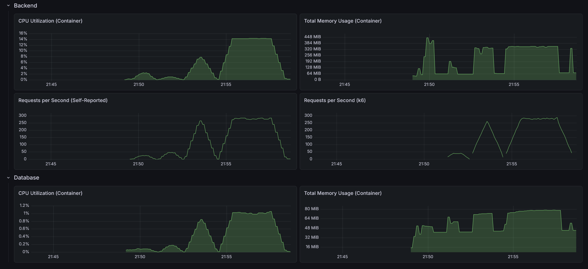

# RealWorld Backend: TypeScript + Bun + Hono ("Hive" - Vertical Hexagonal)

This is an implementation of the [RealWorld API](https://docs.realworld.show/specs/backend-specs/introduction/) using TypeScript, Hono, and a **Vertical Hexagonal Architecture**, also known as **Hive**, running on the Bun runtime. It combines the isolation of Hexagonal Architecture with the locality and cohesion of Vertical Slices.

## Architecture (The Hive)

The architecture is divided into three distinct layers, organized by their role in the system:

- **Shared (`src/shared`)**: The foundation. Contains technical primitives (config, database setup, JWT handling, error mapping). It is business-agnostic and depends on nothing but external libraries.
- **Cells (`src/cells`)**: The business features. Each subdirectory represents a self-contained "cell" (a mini-hexagon). A cell contains its own domain, ports (interfaces), and adapters (Controllers, Repositories).
    - *Independence*: Cells act almost like internal microservices.
    - *Strict Communication*: Cells only communicate with each other through defined interfaces (Ports). A cell NEVER imports another cell's database adapter or handler.
- **The Hive (`src/hive`)**: The orchestration layer (Composition Root). It depends on `shared` and all `cells`. It is responsible for instantiating the database, creating all cells, injecting dependencies (satisfying cell ports), and wiring up the final Hono application.

## Tech Stack

- **Bun Runtime** (native TS execution, native HTTP server via `Bun.serve`)
- **Hono**: Ultrafast, web-standards based web framework
- **pg-promise**: PostgreSQL interface for Node.js
- **Zod**: TypeScript-first schema validation
- **Bun.password**: Native Argon2id password hashing
- **Jose**: JSON Web Token (JWT) implementation
- **Bun Test**: Native, high-performance test runner

## Directory Structure

```text
.
├── Dockerfile              # Production Docker build using Bun
├── src/
│   ├── index.ts            # Entry point - Boots the Bun native HTTP server
│   ├── cells/              # --- THE BUSINESS FEATURES (VERTICAL SLICES) ---
│   │   ├── user/           # User & Profile management
│   │   │   ├── user.domain.ts      # Business entities & logic
│   │   │   ├── user.ports.ts       # Interfaces required by this cell
│   │   │   ├── user.service.ts     # Business orchestration
│   │   │   ├── user.repository.ts  # SQL DB Adapter
│   │   │   ├── user.controller.ts  # HTTP REST Adapter
│   │   │   └── user.validator.ts   # Request validation schemas
│   │   ├── article/        # Article & Tag management
│   │   └── comment/        # Comment management
│   ├── hive/               # --- THE WIRING LAYER (COMPOSITION ROOT) ---
│   │   └── app.ts          # Wires cells together, resolves dependencies
│   └── shared/             # --- TECHNICAL PRIMITIVES ---
│       ├── config/         # App configuration
│       ├── database/       # DB initialization
│       ├── errors/         # Global error types
│       ├── security/       # JWT & Password hashing
│       └── web/            # Middleware & HTTP helpers
├── package.json            # Dependencies and scripts
└── README.md
```

## Why this works for TypeScript/Bun/Hono

1.  **Type Safety across Boundaries**: Ports (interfaces) ensure that cells interact predictably, leveraging TypeScript's strong typing without tight coupling.
2.  **Circular Dependency Prevention**: By grouping by business boundary and using ESM, tight coupling becomes obvious, and circular imports are easily caught.
3.  **Scalability**: You can work on the Article feature without ever seeing the User code. It maps perfectly to team ownership in larger organizations.
4.  **Clean Entry Point**: The `index.ts` remains pristine, focusing on infrastructure (HTTP server initialization), while the orchestration logic (`hive`) is easily testable.

## Performance

- Max CPU Utilization: 14.3%
- Max Memory Usage: 443 MiB
- Max Requests per Second: 286 / 289



### API test suite

- On startup: 1.54s
- After 10 warm-up runs: 1.55s
- After load test: 1.54s

### Load test suite (TBD)

#### Light load (10 VUs / 30s)

    HTTP
    http_req_duration..............: avg=6.71ms   min=414.41µs med=2.5ms    max=250.84ms p(90)=5.56ms   p(95)=10.66ms 
      { expected_response:true }...: avg=6.71ms   min=414.41µs med=2.5ms    max=250.84ms p(90)=5.56ms   p(95)=10.66ms 
      { name:AddComment }..........: avg=3.58ms   min=1.99ms   med=2.82ms   max=22.7ms   p(90)=5.06ms   p(95)=6.81ms  
      { name:CreateArticle }.......: avg=5.97ms   min=2.8ms    med=4.42ms   max=41.8ms   p(90)=6.9ms    p(95)=11.21ms 
      { name:DeleteArticle }.......: avg=5.21ms   min=2.84ms   med=4.23ms   max=26.85ms  p(90)=6.86ms   p(95)=10.33ms 
      { name:DeleteComment }.......: avg=2.83ms   min=1.44ms   med=2.22ms   max=15.42ms  p(90)=4.29ms   p(95)=5.86ms  
      { name:FavoriteArticle }.....: avg=3.98ms   min=2.38ms   med=3.18ms   max=16.27ms  p(90)=5.79ms   p(95)=8.96ms  
      { name:FollowUser }..........: avg=4.22ms   min=1.74ms   med=2.58ms   max=52.03ms  p(90)=4.63ms   p(95)=5.57ms  
      { name:GetArticle }..........: avg=1.25ms   min=739.13µs med=1.05ms   max=4.49ms   p(90)=2.11ms   p(95)=2.7ms   
      { name:GetArticlesFeed }.....: avg=2.63ms   min=1.08ms   med=1.57ms   max=36.36ms  p(90)=3.59ms   p(95)=6.05ms  
      { name:GetComments }.........: avg=1.68ms   min=996.34µs med=1.41ms   max=6.99ms   p(90)=2.73ms   p(95)=3.7ms   
      { name:GetCurrentUser }......: avg=1.63ms   min=768.63µs med=1.18ms   max=12.95ms  p(90)=1.41ms   p(95)=1.65ms  
      { name:GetGlobalArticles }...: avg=2.39ms   min=1.39ms   med=1.87ms   max=25.85ms  p(90)=3.14ms   p(95)=4.29ms  
      { name:GetProfile }..........: avg=1.7ms    min=612.32µs med=1.05ms   max=33.2ms   p(90)=2.54ms   p(95)=3.42ms  
      { name:GetTags }.............: avg=954.59µs min=414.41µs med=659.67µs max=4.35ms   p(90)=1.98ms   p(95)=2.74ms  
      { name:Login }...............: avg=131.74ms min=117.16ms med=124.37ms max=205.6ms  p(90)=146.35ms p(95)=148.98ms
      { name:Register }............: avg=142.37ms min=117.69ms med=131.71ms max=250.84ms p(90)=168.51ms p(95)=182.84ms
      { name:UnfavoriteArticle }...: avg=4.04ms   min=2.19ms   med=3.27ms   max=17.01ms  p(90)=6ms      p(95)=8.21ms  
      { name:UnfollowUser }........: avg=2.62ms   min=1.64ms   med=2.25ms   max=8.12ms   p(90)=3.82ms   p(95)=4.14ms  
    http_req_failed................: 0.00%  0 out of 2408
    http_reqs......................: 2408   74.547362/s

    EXECUTION
    iteration_duration.............: avg=1.05s    min=1s       med=1.03s    max=1.25s    p(90)=1.13s    p(95)=1.14s   
    iterations.....................: 290    8.97788/s
    vus............................: 5      min=0         max=10
    vus_max........................: 10     min=10        max=10

    NETWORK
    data_received..................: 1.3 MB 41 kB/s
    data_sent......................: 593 kB 18 kB/s

#### Medium load (50 VUs / 1m)

    HTTP
    http_req_duration..............: avg=34.05ms  min=372.41µs med=11.31ms  max=840.9ms  p(90)=94.73ms  p(95)=170.2ms 
      { expected_response:true }...: avg=34.05ms  min=372.41µs med=11.31ms  max=840.9ms  p(90)=94.73ms  p(95)=170.2ms 
      { name:AddComment }..........: avg=50.62ms  min=2.02ms   med=26.07ms  max=448.31ms p(90)=115.86ms p(95)=180.67ms
      { name:CreateArticle }.......: avg=74.41ms  min=2.64ms   med=43.38ms  max=439.66ms p(90)=194.86ms p(95)=261.83ms
      { name:DeleteArticle }.......: avg=25.28ms  min=2.33ms   med=21.98ms  max=171.95ms p(90)=46.36ms  p(95)=56.4ms  
      { name:DeleteComment }.......: avg=16.58ms  min=1.36ms   med=12.4ms   max=180.33ms p(90)=30.27ms  p(95)=47.09ms 
      { name:FavoriteArticle }.....: avg=43.03ms  min=2.19ms   med=25.16ms  max=433.47ms p(90)=99.04ms  p(95)=176.18ms
      { name:FollowUser }..........: avg=24.95ms  min=1.19ms   med=5.2ms    max=387.41ms p(90)=54.07ms  p(95)=149.15ms
      { name:GetArticle }..........: avg=11.81ms  min=605.02µs med=7.43ms   max=148.25ms p(90)=24.07ms  p(95)=33.45ms 
      { name:GetArticlesFeed }.....: avg=7.81ms   min=942.23µs med=5.71ms   max=261.32ms p(90)=13.85ms  p(95)=17.55ms 
      { name:GetComments }.........: avg=16.29ms  min=1.04ms   med=14.33ms  max=95.25ms  p(90)=33.51ms  p(95)=41.62ms 
      { name:GetCurrentUser }......: avg=17.21ms  min=606.03µs med=3.83ms   max=295.92ms p(90)=41.41ms  p(95)=94.58ms 
      { name:GetGlobalArticles }...: avg=9.41ms   min=1.36ms   med=7.3ms    max=38.39ms  p(90)=18.79ms  p(95)=23.11ms 
      { name:GetProfile }..........: avg=29.86ms  min=539.02µs med=2.84ms   max=468.12ms p(90)=119.66ms p(95)=212.91ms
      { name:GetTags }.............: avg=5ms      min=372.41µs med=3.66ms   max=28.01ms  p(90)=11.21ms  p(95)=13.7ms  
      { name:Login }...............: avg=218.12ms min=118.79ms med=186.71ms max=762.71ms p(90)=333.08ms p(95)=433.86ms
      { name:Register }............: avg=217.29ms min=113.08ms med=183.62ms max=840.9ms  p(90)=315.27ms p(95)=437.22ms
      { name:UnfavoriteArticle }...: avg=25.02ms  min=2.09ms   med=21.9ms   max=204.32ms p(90)=48.95ms  p(95)=60.6ms  
      { name:UnfollowUser }........: avg=18.41ms  min=1.5ms    med=4.59ms   max=336.73ms p(90)=42.35ms  p(95)=84.69ms 
    http_req_failed................: 0.00%  0 out of 15611
    http_reqs......................: 15611  250.357671/s

    EXECUTION
    iteration_duration.............: avg=1.21s    min=1s       med=1.19s    max=1.87s    p(90)=1.41s    p(95)=1.5s    
    iterations.....................: 2479   39.756368/s
    vus............................: 10     min=0          max=50
    vus_max........................: 50     min=50         max=50

    NETWORK
    data_received..................: 8.5 MB 136 kB/s
    data_sent......................: 3.8 MB 61 kB/s

#### Heavy load (200 VUs / 3m)

    HTTP
    http_req_duration..............: avg=503.68ms min=306.02µs med=224.51ms max=5.62s    p(90)=1.45s   p(95)=1.92s   
      { expected_response:true }...: avg=503.68ms min=306.02µs med=224.51ms max=5.62s    p(90)=1.45s   p(95)=1.92s   
      { name:AddComment }..........: avg=593.23ms min=2.82ms   med=389.05ms max=3.13s    p(90)=1.4s    p(95)=1.9s    
      { name:CreateArticle }.......: avg=719.9ms  min=4.4ms    med=503.83ms max=3.42s    p(90)=1.63s   p(95)=2.09s   
      { name:DeleteArticle }.......: avg=594.39ms min=3.54ms   med=379.65ms max=4.12s    p(90)=1.45s   p(95)=1.88s   
      { name:DeleteComment }.......: avg=525.27ms min=2.17ms   med=331.16ms max=3.17s    p(90)=1.43s   p(95)=1.64s   
      { name:FavoriteArticle }.....: avg=574.9ms  min=3.67ms   med=367.49ms max=3.78s    p(90)=1.42s   p(95)=1.74s   
      { name:FollowUser }..........: avg=621.54ms min=2.13ms   med=387.53ms max=3.14s    p(90)=1.59s   p(95)=2.02s   
      { name:GetArticle }..........: avg=23.52ms  min=617.65µs med=12.46ms  max=264.03ms p(90)=53.45ms p(95)=74.41ms 
      { name:GetArticlesFeed }.....: avg=475.64ms min=1.24ms   med=219.26ms max=3.77s    p(90)=1.39s   p(95)=1.81s   
      { name:GetComments }.........: avg=41.98ms  min=972.27µs med=27.62ms  max=243.39ms p(90)=98.22ms p(95)=119.69ms
      { name:GetCurrentUser }......: avg=544.18ms min=995.96µs med=324.99ms max=3.4s     p(90)=1.36s   p(95)=1.77s   
      { name:GetGlobalArticles }...: avg=33.24ms  min=1.52ms   med=23.02ms  max=211.13ms p(90)=78.05ms p(95)=96.12ms 
      { name:GetProfile }..........: avg=574.48ms min=809.66µs med=312.48ms max=3.39s    p(90)=1.57s   p(95)=1.91s   
      { name:GetTags }.............: avg=24.85ms  min=306.02µs med=17.71ms  max=140.57ms p(90)=57.43ms p(95)=73.41ms 
      { name:Login }...............: avg=1.54s    min=159.9ms  med=1.38s    max=5.62s    p(90)=2.7s    p(95)=3.17s   
      { name:Register }............: avg=1.54s    min=117.28ms med=1.41s    max=5.29s    p(90)=2.7s    p(95)=3.15s   
      { name:UnfavoriteArticle }...: avg=576.12ms min=3.38ms   med=418.41ms max=3.34s    p(90)=1.3s    p(95)=1.66s   
      { name:UnfollowUser }........: avg=526.03ms min=1.82ms   med=319.88ms max=3.4s     p(90)=1.41s   p(95)=1.69s   
    http_req_failed................: 0.00% 0 out of 51187
    http_reqs......................: 51187 278.610828/s

    EXECUTION
    iteration_duration.............: avg=3.46s    min=1s       med=3.22s    max=12.99s   p(90)=5.43s   p(95)=6.39s   
    iterations.....................: 10485 57.069852/s
    vus............................: 120   min=0          max=200
    vus_max........................: 200   min=200        max=200

    NETWORK
    data_received..................: 29 MB 158 kB/s
    data_sent......................: 13 MB 68 kB/s
