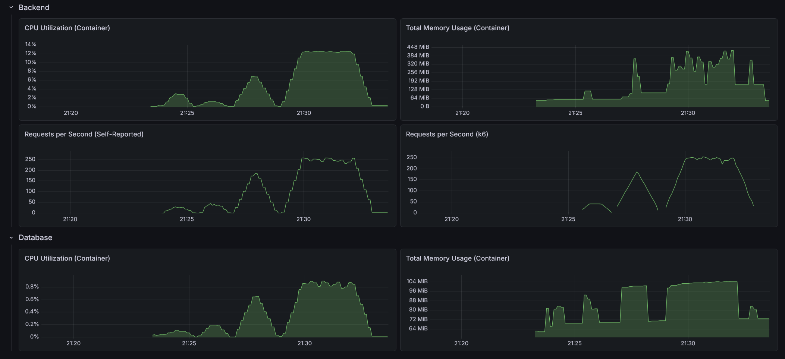

# RealWorld Backend: TypeScript + Express ("Hive" - Vertical Hexagonal)

This is an implementation of the [RealWorld API](https://docs.realworld.show/specs/backend-specs/introduction/) using TypeScript, Express, and a **Vertical Hexagonal Architecture**, also known as **Hive**. It combines the isolation of Hexagonal Architecture with the locality and cohesion of Vertical Slices.

## Architecture (The Hive)

The architecture is divided into three distinct layers, organized by their role in the system:

- **Shared (`src/shared`)**: The foundation. Contains technical primitives (config, database setup, JWT handling, error mapping). It is business-agnostic and depends on nothing but external libraries.
- **Cells (`src/cells`)**: The business features. Each subdirectory represents a self-contained "cell" (a mini-hexagon). A cell contains its own domain, ports (interfaces), and adapters (Controllers, Repositories).
    - *Independence*: Cells act almost like internal microservices.
    - *Strict Communication*: Cells only communicate with each other through defined interfaces (Ports). A cell NEVER imports another cell's database adapter or handler.
- **The Hive (`src/hive`)**: The orchestration layer (Composition Root). It depends on `shared` and all `cells`. It is responsible for instantiating the database, creating all cells, injecting dependencies (satisfying cell ports), and wiring up the final Express application.

## Tech Stack

- **Node.js 24+** (running with ESM)
- **Express**: Fast, unopinionated, minimalist web framework
- **pg-promise**: PostgreSQL interface for Node.js
- **Zod**: TypeScript-first schema validation
- **Argon2**: Secure password hashing
- **Jose**: JSON Web Token (JWT) implementation
- **OpenTelemetry**: Observability, distributed tracing, and metrics
- **Vitest**: Blazing fast unit and integration testing

## Directory Structure

```text
.
├── Dockerfile              # Multi-stage production build
├── src/
│   ├── index.ts            # Entry point - Initializes OTEL and the Hive
│   ├── cells/              # --- THE BUSINESS FEATURES (VERTICAL SLICES) ---
│   │   ├── user/           # User & Profile management
│   │   │   ├── user.domain.ts      # Business entities & logic
│   │   │   ├── user.ports.ts       # Interfaces required by this cell
│   │   │   ├── user.service.ts     # Business orchestration
│   │   │   ├── user.repository.ts  # SQL DB Adapter
│   │   │   ├── user.controller.ts  # HTTP REST Adapter
│   │   │   └── user.validator.ts   # Request validation schemas
│   │   ├── article/        # Article & Tag management
│   │   └── comment/        # Comment management
│   ├── hive/               # --- THE WIRING LAYER (COMPOSITION ROOT) ---
│   │   └── app.ts          # Wires cells together, resolves dependencies
│   └── shared/             # --- TECHNICAL PRIMITIVES ---
│       ├── config/         # App configuration & OTEL setup
│       ├── database/       # DB initialization
│       ├── errors/         # Global error types
│       ├── security/       # JWT & Password hashing
│       └── web/            # Middleware & HTTP helpers
├── package.json            # Dependencies and scripts
└── README.md
```

## Why this works for TypeScript/Express

1.  **Type Safety across Boundaries**: Ports (interfaces) ensure that cells interact predictably, leveraging TypeScript's strong typing without tight coupling.
2.  **Circular Dependency Prevention**: By grouping by business boundary and using ESM, tight coupling becomes obvious, and circular imports are easily caught.
3.  **Scalability**: You can work on the Article feature without ever seeing the User code. It maps perfectly to team ownership in larger organizations.
4.  **Clean Entry Point**: The `index.ts` remains pristine, focusing on infrastructure (OTEL, environment), while the orchestration logic (`hive`) is easily testable.

## Performance

- Max CPU Utilization: 12.6%
- Max Memory Usage: 424 MiB
- Max Requests per Second: 259 / 254



### API test suite

- On startup: 1.72s
- After 10 warm-up runs: 1.51s
- After load test: 1.56s

### Load test suite (TBD)

#### Light load (10 VUs / 30s)

    HTTP
    http_req_duration..............: avg=6.95ms   min=641.32µs med=3.21ms   max=232.88ms p(90)=9.13ms   p(95)=14.89ms 
      { expected_response:true }...: avg=6.95ms   min=641.32µs med=3.21ms   max=232.88ms p(90)=9.13ms   p(95)=14.89ms 
      { name:AddComment }..........: avg=5.08ms   min=2.52ms   med=3.68ms   max=38.57ms  p(90)=9.55ms   p(95)=13.55ms 
      { name:CreateArticle }.......: avg=9.72ms   min=3.69ms   med=5.64ms   max=96.75ms  p(90)=12.95ms  p(95)=23.15ms 
      { name:DeleteArticle }.......: avg=7.13ms   min=3.58ms   med=5.04ms   max=34.09ms  p(90)=12.63ms  p(95)=18.64ms 
      { name:DeleteComment }.......: avg=3.83ms   min=1.81ms   med=2.7ms    max=19.42ms  p(90)=7.46ms   p(95)=10.88ms 
      { name:FavoriteArticle }.....: avg=5.4ms    min=2.84ms   med=4.12ms   max=29.05ms  p(90)=8.68ms   p(95)=13.17ms 
      { name:FollowUser }..........: avg=3.9ms    min=2.15ms   med=3.21ms   max=17.33ms  p(90)=6.21ms   p(95)=8.08ms  
      { name:GetArticle }..........: avg=1.98ms   min=923.14µs med=1.48ms   max=8.74ms   p(90)=3.53ms   p(95)=5.27ms  
      { name:GetArticlesFeed }.....: avg=3.14ms   min=1.43ms   med=2.21ms   max=13.32ms  p(90)=6.24ms   p(95)=7.82ms  
      { name:GetComments }.........: avg=2.66ms   min=1.31ms   med=1.88ms   max=23.09ms  p(90)=4.51ms   p(95)=6.43ms  
      { name:GetCurrentUser }......: avg=3.32ms   min=1.04ms   med=2.08ms   max=8.64ms   p(90)=8.02ms   p(95)=8.22ms  
      { name:GetGlobalArticles }...: avg=3.08ms   min=1.83ms   med=2.5ms    max=11.66ms  p(90)=4.65ms   p(95)=7.01ms  
      { name:GetProfile }..........: avg=2.23ms   min=972.64µs med=1.73ms   max=48.74ms  p(90)=2.96ms   p(95)=3.9ms   
      { name:GetTags }.............: avg=1.4ms    min=641.32µs med=979.99µs max=10.31ms  p(90)=2.04ms   p(95)=4.31ms  
      { name:Login }...............: avg=96.91ms  min=75.44ms  med=90.72ms  max=158.17ms p(90)=138.04ms p(95)=142.64ms
      { name:Register }............: avg=103.02ms min=78.69ms  med=97.35ms  max=232.88ms p(90)=124.62ms p(95)=134.87ms
      { name:UnfavoriteArticle }...: avg=5.46ms   min=2.84ms   med=3.98ms   max=22.29ms  p(90)=10.86ms  p(95)=13.34ms 
      { name:UnfollowUser }........: avg=3.92ms   min=2.21ms   med=2.98ms   max=27.21ms  p(90)=6.13ms   p(95)=9.72ms  
    http_req_failed................: 0.00%  0 out of 2422
    http_reqs......................: 2422   75.796043/s

    EXECUTION
    iteration_duration.............: avg=1.05s    min=1s       med=1.04s    max=1.23s    p(90)=1.1s     p(95)=1.13s   
    iterations.....................: 290    9.075497/s
    vus............................: 10     min=10        max=10
    vus_max........................: 10     min=10        max=10

    NETWORK
    data_received..................: 1.6 MB 51 kB/s
    data_sent......................: 598 kB 19 kB/s

#### Medium load (50 VUs / 1m)

    HTTP
    http_req_duration..............: avg=110.48ms min=635.02µs med=37.89ms  max=952.98ms p(90)=379.69ms p(95)=445.84ms
      { expected_response:true }...: avg=110.48ms min=635.02µs med=37.89ms  max=952.98ms p(90)=379.69ms p(95)=445.84ms
      { name:AddComment }..........: avg=147.78ms min=45.68ms  med=143.61ms max=470.46ms p(90)=211.81ms p(95)=238.92ms
      { name:CreateArticle }.......: avg=378.65ms min=57.57ms  med=383.36ms max=717.32ms p(90)=457.07ms p(95)=474.9ms 
      { name:DeleteArticle }.......: avg=39.04ms  min=9.71ms   med=37.72ms  max=120.06ms p(90)=62.94ms  p(95)=74.7ms  
      { name:DeleteComment }.......: avg=27.41ms  min=9.06ms   med=24.18ms  max=487.18ms p(90)=41.73ms  p(95)=46.46ms 
      { name:FavoriteArticle }.....: avg=104.35ms min=20.24ms  med=105.57ms max=436.3ms  p(90)=187.36ms p(95)=210.78ms
      { name:FollowUser }..........: avg=121.47ms min=2.47ms   med=9.5ms    max=541.9ms  p(90)=310.6ms  p(95)=322.4ms 
      { name:GetArticle }..........: avg=52.08ms  min=2.77ms   med=47.67ms  max=128.6ms  p(90)=94.21ms  p(95)=101.46ms
      { name:GetArticlesFeed }.....: avg=11.08ms  min=2.5ms    med=10.36ms  max=44.93ms  p(90)=16.94ms  p(95)=24.4ms  
      { name:GetComments }.........: avg=34.35ms  min=10.84ms  med=32.56ms  max=155.05ms p(90)=44.87ms  p(95)=50.23ms 
      { name:GetCurrentUser }......: avg=163.19ms min=10.3ms   med=227.43ms max=343.4ms  p(90)=282.69ms p(95)=289.38ms
      { name:GetGlobalArticles }...: avg=14.36ms  min=2.18ms   med=13.36ms  max=56.52ms  p(90)=25.17ms  p(95)=34.57ms 
      { name:GetProfile }..........: avg=153.28ms min=1.04ms   med=6.26ms   max=536.13ms p(90)=399.55ms p(95)=412.01ms
      { name:GetTags }.............: avg=8.63ms   min=635.02µs med=8.08ms   max=42.92ms  p(90)=16.93ms  p(95)=20.25ms 
      { name:Login }...............: avg=560.05ms min=410.18ms med=503.55ms max=837.74ms p(90)=722.42ms p(95)=756.35ms
      { name:Register }............: avg=580.27ms min=77.68ms  med=699.06ms max=952.98ms p(90)=773.38ms p(95)=797.52ms
      { name:UnfavoriteArticle }...: avg=47.25ms  min=17.12ms  med=46.89ms  max=207.6ms  p(90)=67.87ms  p(95)=71.53ms 
      { name:UnfollowUser }........: avg=27.88ms  min=2.16ms   med=7.61ms   max=267.75ms p(90)=64.44ms  p(95)=74.55ms 
    http_req_failed................: 0.00%  0 out of 11223
    http_reqs......................: 11223  181.619763/s

    EXECUTION
    iteration_duration.............: avg=1.69s    min=1s       med=1.71s    max=2.04s    p(90)=1.8s     p(95)=1.82s   
    iterations.....................: 1784   28.870147/s
    vus............................: 50     min=0          max=50
    vus_max........................: 50     min=50         max=50

    NETWORK
    data_received..................: 7.5 MB 122 kB/s
    data_sent......................: 2.7 MB 44 kB/s

#### Heavy load (200 VUs / 3m)

    HTTP
    http_req_duration..............: avg=615.29ms min=634.12µs med=185.14ms max=3.64s    p(90)=2.19s    p(95)=2.51s   
      { expected_response:true }...: avg=615.29ms min=634.12µs med=185.14ms max=3.64s    p(90)=2.19s    p(95)=2.51s   
      { name:AddComment }..........: avg=539.66ms min=11.42ms  med=497.83ms max=2.99s    p(90)=903.94ms p(95)=996.44ms
      { name:CreateArticle }.......: avg=2.04s    min=40.45ms  med=2.1s     max=3.63s    p(90)=2.49s    p(95)=2.65s   
      { name:DeleteArticle }.......: avg=203.26ms min=4.04ms   med=119.14ms max=2.55s    p(90)=372.18ms p(95)=479.21ms
      { name:DeleteComment }.......: avg=208.94ms min=2.19ms   med=87.51ms  max=2.39s    p(90)=337.13ms p(95)=515.3ms 
      { name:FavoriteArticle }.....: avg=433.4ms  min=10.15ms  med=391.77ms max=2.88s    p(90)=798.12ms p(95)=873.61ms
      { name:FollowUser }..........: avg=733.62ms min=2.57ms   med=800.49ms max=3s       p(90)=1.23s    p(95)=1.37s   
      { name:GetArticle }..........: avg=180.59ms min=931.14µs med=178.58ms max=492.56ms p(90)=288.62ms p(95)=320.19ms
      { name:GetArticlesFeed }.....: avg=201.34ms min=1.35ms   med=38.9ms   max=2.42s    p(90)=302.57ms p(95)=2.05s   
      { name:GetComments }.........: avg=107.36ms min=2.19ms   med=89.37ms  max=262.85ms p(90)=179.31ms p(95)=212.37ms
      { name:GetCurrentUser }......: avg=704.5ms  min=1.29ms   med=705.01ms max=2.48s    p(90)=1.11s    p(95)=1.22s   
      { name:GetGlobalArticles }...: avg=62.76ms  min=2ms      med=51.8ms   max=252.16ms p(90)=114.28ms p(95)=145.15ms
      { name:GetProfile }..........: avg=1.33s    min=1.03ms   med=1.76s    max=2.66s    p(90)=2.28s    p(95)=2.36s   
      { name:GetTags }.............: avg=64.48ms  min=634.12µs med=50.85ms  max=450.49ms p(90)=133.95ms p(95)=176.86ms
      { name:Login }...............: avg=2.56s    min=157.35ms med=2.6s     max=3.59s    p(90)=2.97s    p(95)=3.11s   
      { name:Register }............: avg=2.47s    min=77.5ms   med=2.9s     max=3.64s    p(90)=3.36s    p(95)=3.41s   
      { name:UnfavoriteArticle }...: avg=203.69ms min=13.17ms  med=157.66ms max=2.95s    p(90)=312.03ms p(95)=359.72ms
      { name:UnfollowUser }........: avg=279.55ms min=2.44ms   med=196.53ms max=2.53s    p(90)=461.14ms p(95)=776.06ms
    http_req_failed................: 0.00% 0 out of 45516
    http_reqs......................: 45516 247.487106/s

    EXECUTION
    iteration_duration.............: avg=4.3s     min=1s       med=4.32s    max=9.39s    p(90)=4.78s    p(95)=5.23s   
    iterations.....................: 8488  46.152354/s
    vus............................: 63    min=0          max=200
    vus_max........................: 200   min=200        max=200

    NETWORK
    data_received..................: 31 MB 167 kB/s
    data_sent......................: 11 MB 60 kB/s
